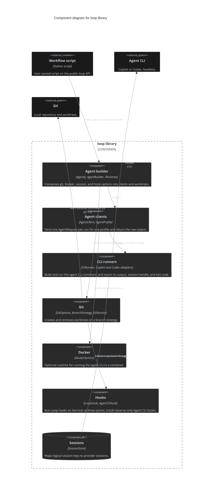

# Loop

The `loop` Python library: a single installable package (`pip install` from this repository, [Install Loop with pip](../adr/install-loop-with-pip-from-the-repository.md)) that a user-owned Workflow script imports to run agent prompts on Git worktrees. It ships no command and no built-in Workflows ([Ship Loop as a workflow library](../adr/ship-loop-as-a-workflow-library-with-no-built-in-workflows.md)).

## Dependencies

- **Called by:** Workflow scripts (user-owned; the `workflows/dev/` package is the example) through the public `loop` API only.
- **Calls (via subprocess):** `git`, the `copilot` and `codex` CLIs, and optionally `docker`. No Python dependency beyond `python-json-logger`.

## Interfaces

Public API re-exported from [`src/loop/__init__.py`](../../src/loop/__init__.py): `Agent()` returns an `AgentBuilder` ([Build agents with an agent builder](../adr/build-agents-with-an-agent-builder-over-profiles-strategies-and-session-stores.md)), configured with `with_git(GitOptions)`, `with_docker`, `with_session`, and `with_agent_cli_hooks`; `create()` yields an `AgentClient` and `open()` a `Worktree` whose `agent(profile)` yields clients. An `AgentProfile` picks the CLI (`copilot`, `codex`), model, and reasoning effort; a run takes an `AgentRequest` and returns an `AgentResult`. Replaceable seams are `CliRunner`, `GitService`, `DockerService`, and `SessionStore`. The GitHub client and the Spec/Ticket tracker are not part of the public API: they live in `workflows/platforms/work_tracking` beside the example workflows.

## Tweaks/Configuration

No config file. A Workflow declares its settings and hooks as code and injects dependencies into the shipped implementations ([Loop Library Workflow Architecture](../concepts/str-loop-library-workflow-architecture.md)).

## Persisted data

A `SessionStore` maps logical agent session keys to provider session identifiers when a Workflow calls `with_session()`; an in-memory store is provided. Nothing else is persisted by the library; Workflows own their own state.

## Source-folder structure

Paths relative to `src/loop/`.

```text
__init__.py     public API
factory.py      Agent() composition root
builder.py      AgentBuilder, Worktree
dryrun/         logging-only adapters for the demo
agents/         AgentClient, AgentProfile, copilot and codex profiles, wrappers over a client
clis/           CliRunner and the Copilot and Codex CLI adapters
docker/         DockerRuntime and DockerService
git/            GitOptions, BranchStrategy, MergeToHeadStrategy, HeadStrategy, GitService, git CLI
run/            AgentRequest, AgentResult, RunContext
hooks/          Loop hooks (worktree-ready, worktree-removing, run-finished), Agent CLI hooks
sessions/       SessionStore and session values
```

Dependency rule (enforced by import-linter in `pyproject.toml`): a strict layering `factory` > `builder | dryrun` > `agents` > `clis | docker | git` > `run` > `hooks` > `sessions`; `workflows` import only the public `loop` API and `workflows.platforms` import no Workflow.

## Container view

See the solution-level diagram in [system-context.md](system-context.md#solution-container-view); Loop is a single container.

## Component view



## Concepts

Loop is the only Deployable, so its Concepts are system-wide and indexed in [ARCHITECTURE.md](../../ARCHITECTURE.md#crosscutting-concepts).

## Architecture Decision Records

Likewise indexed in [ARCHITECTURE.md](../../ARCHITECTURE.md#architecture-decision-records).

## Key features

- **Agent builder:** `Agent()` composes git, Docker, session, and hook options into agent clients and worktrees; agents run on the host with the worktree as working directory ([Build agents with an agent builder](../adr/build-agents-with-an-agent-builder-over-profiles-strategies-and-session-stores.md)).
- **Agent profiles:** the CLI (Copilot, Codex), model, and reasoning effort are chosen per client; the library returns the CLI's raw stdout and the Workflow parses it.
- **Git worktrees and hooks:** `BranchStrategy`, `MergeToHeadStrategy`, and `HeadStrategy` choose the worktree branch; Loop hooks run at `worktree-ready`, `worktree-removing`, and `run-finished`. Push, pull requests, and Ticket state stay in Workflow Python, while the agent commits each task ([Run one fresh agent per Ticket](../adr/run-one-fresh-agent-per-ticket-from-python-and-let-the-agent-commit-it.md)).
- **Dry run:** `AgentOptions(dry_run=True)` exercises the builder with logging-only adapters.
- **Logging:** the library logs under the `loop` logger and stays silent until the host calls `configure_logging()`. INFO goes to the console only; DEBUG adds detail and also writes JSON lines to a configurable file (`log_file=None` disables it).
