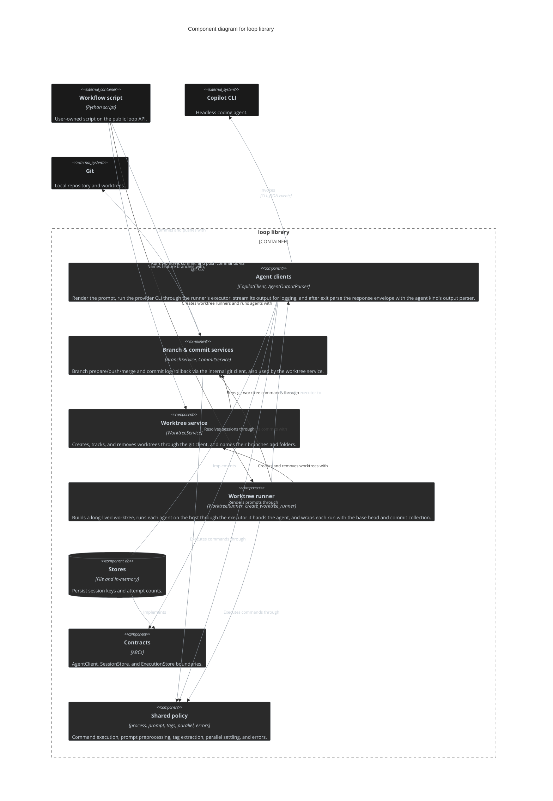

# Loop

The `loop` Python library: a single installable package (`pip install` from this repository, [ADR 0001](../adr/0001-install-loop-with-pip-from-the-repository.md)) that a user-owned Workflow script imports to run agent prompts on Git worktrees. It ships no command and no built-in Workflows ([ADR 0003](../adr/0003-ship-loop-as-a-workflow-library-with-no-built-in-workflows.md)).

## Dependencies

- **Called by:** Workflow scripts (user-owned; the `workflows/dev/` package is the example) through the public `loop` API only.
- **Calls (via subprocess):** `git`, `gh`, and the `copilot` CLI. No Python dependency beyond `python-json-logger`.

## Interfaces

Public API re-exported from [`src/loop/__init__.py`](../../src/loop/__init__.py). ABC contracts exist only where Loop calls replaceable parts: `AgentClient`, `SessionStore`, `ExecutionStore`. `BranchService`, `WorktreeService`, and `CommitService` are concrete helpers; the git client is an internal command runner, not part of the public API. The GitHub client and the Spec/Ticket tracker are not part of the public API either: they live in `workflows/platforms/work_tracking` beside the example workflows.

## Tweaks/Configuration

No config file. A Workflow declares its settings and hooks as code and injects dependencies into the shipped implementations ([Loop Library Workflow Architecture](../concepts/str-loop-library-workflow-architecture.md)).

## Persisted data

`FileExecutionStore` (failure counts per workflow-chosen key) and `FileSessionStore` (logical agent session keys to provider session names); in-memory variants for tests.

## Source-folder structure

Paths relative to `src/loop/`.

```text
__init__.py     public API
contracts/      ABCs: AgentClient, SessionStore, ExecutionStore
runs/           WorktreeRunner and create_worktree_runner (worktree + host agent runs), run_host_hooks
agents/         CopilotClient, AgentOutputParser per agent kind, fake agent and Copilot CLI doubles
platforms/      git/ (BranchService, WorktreeService, CommitService over an internal git client; branch, feature-branch, and worktree-path naming), fake doubles
stores/         file and in-memory execution/session stores
process.py      CommandExecutor, streaming/cancellable subprocess execution
prompt.py       PromptPreprocessor (prompt placeholders and args)
tags.py         extract_tag, extract_json
parallel.py     parallel_settled
errors.py       LoopError hierarchy
logging_config.py  configure_logging
testing/        public test doubles for every process boundary
```

Dependency rule (enforced by import-linter in `pyproject.toml`): contracts and shared policy import no implementation; adapters (`agents`, `platforms`, `stores`) import no `runs` code; only `loop.testing` imports test doubles; `workflows.dev` and `workflows.platforms` import only the public `loop` API.

## Container view

See the solution-level diagram in [system-context.md](system-context.md#solution-container-view); Loop is a single container.

## Component view



## Concepts

Loop is the only Deployable, so its Concepts are system-wide and indexed in [ARCHITECTURE.md](../../ARCHITECTURE.md#crosscutting-concepts).

## Architecture Decision Records

Likewise indexed in [ARCHITECTURE.md](../../ARCHITECTURE.md#architecture-decision-records).

## Key features

- **Worktree runner:** a worktree whose agents run on the host from the harness root; the agent is passed per run ([ADR 0008](../adr/0008-run-agents-on-the-host-through-a-worktree-runner-and-pass-the-agent-to-each-run.md)).
- **Agent clients:** Copilot CLI with live output streaming and a per-agent-kind output parser run after exit ([ADR 0007](../adr/0007-stream-agent-output-live-and-parse-it-after-exit-with-a-per-agent-kind-output-parser.md)).
- **Git and GitHub helpers:** worktrees with `worktree-ready` hooks ([ADR 0004](../adr/0004-run-only-pre-agent-shell-command-hooks-on-the-host.md)); push and pull requests stay in Python ([ADR 0006](../adr/0006-keep-commit-push-pull-request-and-ticket-state-changes-in-python.md)), while the agent commits each task ([ADR 0009](../adr/0009-run-one-fresh-agent-per-ticket-from-python-and-let-the-agent-commit-it.md)).
- **Test doubles:** `loop.testing` fakes every process boundary.
