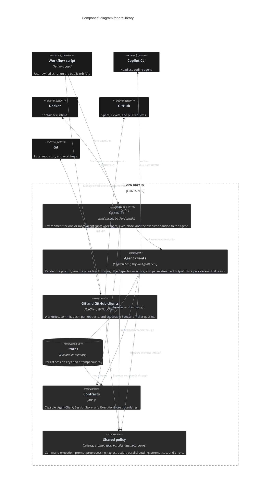

# Orb

The `orb` Python library: a single installable package (`pip install` from this repository, [ADR 0001](../adr/0001-install-orb-with-pip-from-the-repository.md)) that a user-owned Workflow script imports to run agent prompts on Git worktrees through Capsules. It ships no command and no built-in Workflows ([ADR 0003](../adr/0003-ship-orb-as-a-workflow-library-with-no-built-in-workflows.md)).

## Dependencies

- **Called by:** Workflow scripts (user-owned; `workflows/dev.py` is the example) through the public `orb` API only.
- **Calls (via subprocess):** `git`, `gh`, `docker`, and the `copilot` CLI. No Python dependency beyond `python-json-logger`.

## Interfaces

Public API re-exported from [`src/orb/__init__.py`](../../src/orb/__init__.py). ABC contracts exist only where Orb calls replaceable parts: `Capsule`, `AgentClient`, `SessionStore`, `ExecutionStore`. `GitClient` and `GitHubClient` are concrete helpers.

## Tweaks/Configuration

No config file. A Workflow declares its settings and hooks as code and injects dependencies into the shipped implementations ([Orb Library Workflow Architecture](../concepts/str-orb-library-workflow-architecture.md)).

## Persisted data

`FileExecutionStore` (attempt counts per key) and `FileSessionStore` (logical agent session keys to provider session names); in-memory variants for tests and dry runs.

## Source-folder structure

Paths relative to `src/orb/`.

```text
__init__.py     public API
contracts/      ABCs: Capsule, AgentClient, SessionStore, ExecutionStore
capsules/       NoCapsule (host), DockerCapsule (container), FakeDocker double
agents/         CopilotClient, DryRunAgentClient, fake agent and Copilot CLI doubles
platforms/      GitClient (git CLI), GitHubClient (gh CLI), fake doubles
stores/         file and in-memory execution/session stores
process.py      CommandExecutor, streaming/cancellable subprocess execution
prompt.py       PromptPreprocessor (prompt placeholders and args)
tags.py         extract_tag, extract_json
parallel.py     parallel_settled
attempts.py     may_attempt (attempt cap policy)
errors.py       OrbError hierarchy
logging_config.py  configure_logging
testing/        public test doubles for every process boundary
```

Dependency rule (enforced by import-linter in `pyproject.toml`): contracts and shared policy import no implementation; only `orb.testing` imports test doubles; `workflows.dev` imports only the public `orb` API.

## Container view

See the solution-level diagram in [system-context.md](system-context.md#solution-container-view); Orb is a single container.

## Component view



## Concepts

Orb is the only Deployable, so its Concepts are system-wide and indexed in [ARCHITECTURE.md](../../ARCHITECTURE.md#crosscutting-concepts).

## Architecture Decision Records

Likewise indexed in [ARCHITECTURE.md](../../ARCHITECTURE.md#architecture-decision-records).

## Key features

- **Capsules:** host (`NoCapsule`) or container (`DockerCapsule`) environment; the agent is passed per run ([ADR 0008](../adr/0008-pass-the-agent-to-each-capsule-run-instead-of-binding-it-to-the-capsule.md)).
- **Agent clients:** Copilot CLI with live output streaming and a dry-run client ([ADR 0007](../adr/0007-stream-agent-output-live-and-parse-it-in-the-provider-adapter.md)).
- **Git and GitHub helpers:** worktrees with `worktree-ready` hooks ([ADR 0004](../adr/0004-run-only-pre-agent-shell-command-hooks-on-the-host.md)); commit, push, and pull requests stay in Python ([ADR 0006](../adr/0006-keep-commit-push-pull-request-and-ticket-state-changes-in-python.md)).
- **Test doubles:** `orb.testing` fakes every process boundary.
