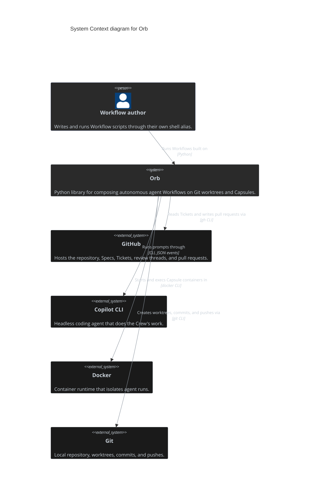
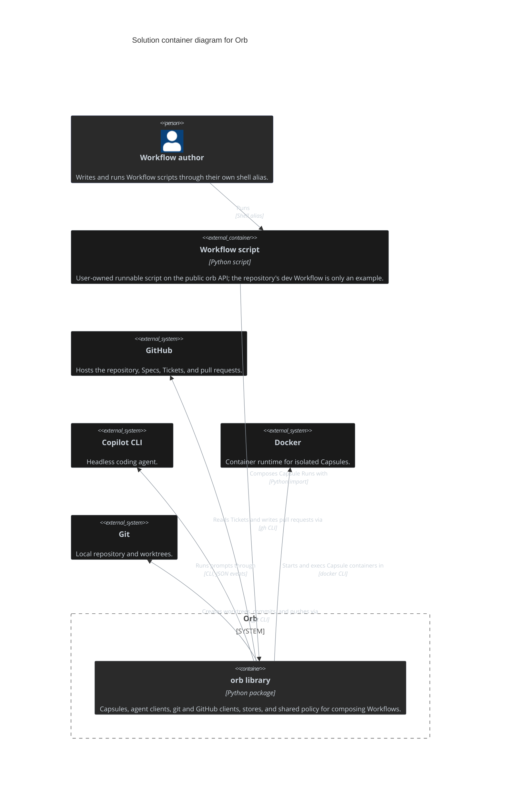

# System Context

## System context

```mermaid
---
config:
  c4:
    c4ShapePadding: 20
---
%% diagram-id: orb-system-context
C4Context
    title System Context diagram for Orb

    Person(author, "Workflow author", "Writes and runs Workflow scripts through their own shell alias.")

    System(orb, "Orb", "Python library for composing autonomous agent Workflows on Git worktrees and Capsules.")

    System_Ext(github, "GitHub", "Hosts the repository, Specs, Tickets, review threads, and pull requests.")
    System_Ext(copilot, "Copilot CLI", "Headless coding agent that does the Crew's work.")
    System_Ext(docker, "Docker", "Container runtime that isolates agent runs.")
    System_Ext(git, "Git", "Local repository, worktrees, commits, and pushes.")

    Rel(author, orb, "Runs Workflows built on", "Python")
    Rel(orb, github, "Reads Tickets and writes pull requests via", "gh CLI")
    Rel(orb, copilot, "Runs prompts through", "CLI, JSON events")
    Rel(orb, docker, "Starts and execs Capsule containers in", "docker CLI")
    Rel(orb, git, "Creates worktrees, commits, and pushes via", "git CLI")

    UpdateElementStyle(author, $fontColor="#c9d1d9", $bgColor="#2a2a2a", $borderColor="#4a5a8a")
    UpdateElementStyle(orb, $fontColor="#c9d1d9", $bgColor="#2a2a2a", $borderColor="#8b949e")
    UpdateElementStyle(github, $fontColor="#c9d1d9", $bgColor="#1a1a1a", $borderColor="#8b949e")
    UpdateElementStyle(copilot, $fontColor="#c9d1d9", $bgColor="#1a1a1a", $borderColor="#8b949e")
    UpdateElementStyle(docker, $fontColor="#c9d1d9", $bgColor="#1a1a1a", $borderColor="#8b949e")
    UpdateElementStyle(git, $fontColor="#c9d1d9", $bgColor="#1a1a1a", $borderColor="#8b949e")

    UpdateRelStyle(author, orb, $textColor="#c9d1d9", $lineColor="#8b949e")
    UpdateRelStyle(orb, github, $textColor="#c9d1d9", $lineColor="#8b949e")
    UpdateRelStyle(orb, copilot, $textColor="#c9d1d9", $lineColor="#8b949e")
    UpdateRelStyle(orb, docker, $textColor="#c9d1d9", $lineColor="#8b949e")
    UpdateRelStyle(orb, git, $textColor="#c9d1d9", $lineColor="#8b949e")
```

## Solution container view

```mermaid
---
config:
  c4:
    c4ShapePadding: 20
---
%% diagram-id: orb-solution-container
C4Container
    title Solution container diagram for Orb

    Person(author, "Workflow author", "Writes and runs Workflow scripts through their own shell alias.")

    Container_Ext(workflow, "Workflow script", "Python script", "User-owned runnable script on the public orb API; the repository's dev Workflow is only an example.")

    System_Boundary(system, "Orb") {
        Container(orb, "orb library", "Python package", "Capsules, agent clients, git and GitHub clients, stores, and shared policy for composing Workflows.")
    }

    System_Ext(github, "GitHub", "Hosts the repository, Specs, Tickets, and pull requests.")
    System_Ext(copilot, "Copilot CLI", "Headless coding agent.")
    System_Ext(docker, "Docker", "Container runtime for isolated Capsules.")
    System_Ext(git, "Git", "Local repository and worktrees.")

    Rel(author, workflow, "Runs", "Shell alias")
    Rel(workflow, orb, "Composes Capsule Runs with", "Python import")
    Rel(orb, github, "Reads Tickets and writes pull requests via", "gh CLI")
    Rel(orb, copilot, "Runs prompts through", "CLI, JSON events")
    Rel(orb, docker, "Starts and execs Capsule containers in", "docker CLI")
    Rel(orb, git, "Creates worktrees, commits, and pushes via", "git CLI")

    UpdateElementStyle(author, $fontColor="#c9d1d9", $bgColor="#2a2a2a", $borderColor="#4a5a8a")
    UpdateElementStyle(workflow, $fontColor="#c9d1d9", $bgColor="#1a1a1a", $borderColor="#8b949e")
    UpdateElementStyle(orb, $fontColor="#c9d1d9", $bgColor="#2a2a2a", $borderColor="#8b949e")
    UpdateElementStyle(github, $fontColor="#c9d1d9", $bgColor="#1a1a1a", $borderColor="#8b949e")
    UpdateElementStyle(copilot, $fontColor="#c9d1d9", $bgColor="#1a1a1a", $borderColor="#8b949e")
    UpdateElementStyle(docker, $fontColor="#c9d1d9", $bgColor="#1a1a1a", $borderColor="#8b949e")
    UpdateElementStyle(git, $fontColor="#c9d1d9", $bgColor="#1a1a1a", $borderColor="#8b949e")

    UpdateRelStyle(author, workflow, $textColor="#c9d1d9", $lineColor="#8b949e")
    UpdateRelStyle(workflow, orb, $textColor="#c9d1d9", $lineColor="#8b949e")
    UpdateRelStyle(orb, github, $textColor="#c9d1d9", $lineColor="#8b949e")
    UpdateRelStyle(orb, copilot, $textColor="#c9d1d9", $lineColor="#8b949e")
    UpdateRelStyle(orb, docker, $textColor="#c9d1d9", $lineColor="#8b949e")
    UpdateRelStyle(orb, git, $textColor="#c9d1d9", $lineColor="#8b949e")
```
