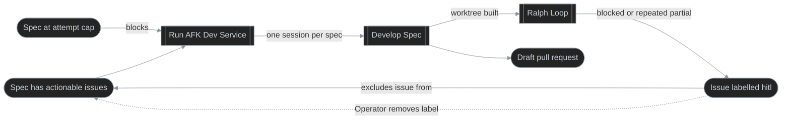

# Autonomous Spec Delivery

## Purpose
Orb delivers the approved work of every open `spec` to a draft pull request without an operator in the session, bounding the attempts it spends on each spec.

## Definition
- **Actors:** Operator; Orb (the `afk_dev` service); Ralph (Copilot agent running the `/ralph:dev` skill); Crew agents (Codey, Chorey, Testy); GitHub.
- **Business processes:** Run AFK Dev Service; Develop Spec; Ralph Loop.
- **Starts:** Operator runs `afk_dev` for a repository board.
- **Ends:** Every open spec was skipped or attempted and its attempt recorded; a Develop Spec run ends with its harness repo pushed and its worktree removed, or exits with a report.

## Business Processes

### Run AFK Dev Service
Actor: Operator; Trigger: `afk_dev` is run for a repository board; Action: Orb lists the open specs, skips those without actionable issues or at their attempt cap, and starts one fresh headless Copilot session per remaining spec with the prompt `/ralph:dev <spec number>`; Outcome: each attempted spec has its attempt recorded, and a spec with all issues resolved has its count cleared. Notes: dry run is on unless switched off, so no session starts but the attempt is still recorded.

```mermaid
%%{init: {'themeVariables': {'lineColor': '#8b949e'}}}%%
%% diagram-id: afk-dev-run-swimlane
swimlane-beta TB
  accTitle: AFK dev run responsibility
  accDescr: Shows how the CLI, Orb, the Copilot agent and GitHub share the work of attempting each open spec.

  subgraph cli [AFK CLI]
    start([Operator runs afk_dev])
    args[Validate arguments and configure logging]
  end

  subgraph orb [Orb - dev use case]
    list[List open specs]
    anySpecs{Specs found?}
    fetch[Fetch spec sub-issues]
    filter{Actionable issues?}
    reset[Clear attempt count when set]
    cap{Attempts reached cap?}
    compose[Compose prompt from prompt text and spec number]
    dry{Dry run?}
    record[Record attempt]
    log[(Execution log)]
    next{Another spec?}
    done([Run completed])
  end

  subgraph copilot [Copilot agent CLI]
    promptIn[/Prompt: ralph:dev skill plus spec number/]
    session[Start non-interactive session]
    dev[[Develop Spec]]
    exitNode[Session ends]
  end

  subgraph ext [External systems - GitHub]
    specs[(Open spec issues)]
    issues[(Spec sub-issues)]
  end

  start --> args -->|repo board, attempt cap, agent alias, prompt, log dir| list
  list -->|query open specs| specs -->|open specs| anySpecs
  anySpecs -->|none| done
  anySpecs -->|found| fetch
  fetch -->|query sub-issues| issues -->|sub-issues| filter
  filter -->|none| reset --> next
  filter -->|some| cap
  cap -->|yes, skip| next
  cap -->|no| compose --> dry
  dry -->|yes, no session| record
  dry -->|no| promptIn --> session --> dev --> exitNode -->|session ended| record
  record -->|persist count| log
  record --> next
  next -->|yes| fetch
  next -->|no| done

  classDef default fill:#242424,stroke:#8b949e,color:#c9d1d9,stroke-width:1px
```

### Develop Spec
Actor: Copilot agent running the `/ralph:dev` skill; Trigger: a session starts with the spec number as its prompt argument; Action: resolve the harness repo and spec, compute the feature branch name, set up and build a worktree, run the Ralph Loop, open a draft pull request, run approved functional-testing tickets through Testy, then push the harness repo and remove the worktree; Outcome: the feature branch carries the committed work, and testing tickets are closed or escalated to a `hitl` investigation. Notes: invalid harness settings, missing spec metadata, a mismatched checkout, a failed build, or a failed commit, push or tracker write exits with a report; functional-test failures never fail the run.

```mermaid
%%{init: {'themeVariables': {'lineColor': '#8b949e'}}}%%
%% diagram-id: develop-spec-swimlane
swimlane-beta TB
  accTitle: Develop Spec responsibility
  accDescr: Shows how the ralph:dev skill, the Crew agents and GitHub share the work of delivering one spec, with the Ralph loop as a subprocess.

  subgraph skill [Copilot agent - ralph:dev skill]
    start([Prompt received with spec number])
    harness[1 - Resolve harness settings]
    hset{2 - Settings status?}
    sync[2c.1 - Sync harness repo with remote]
    spec[3 - Read spec issue]
    valid{4 - Spec and metadata valid?}
    checkout[5 - Derive codebase checkout]
    checkoutOk{6 - Checkout matches repository?}
    branch[7 - Compute feature branch name]
    wt[8 - Create feature worktree]
    build[9 - Build project]
    buildOk{10 - Build passes?}
    exitFail([Exit and report])
    loop[[11 - Ralph Loop]]
    pr[12 - Open draft PR when none exists]
    ft[13 - Publish revision and select tests tickets]
    ready{14 - Dependencies complete?}
    ftRecord[14a.2 - Record evidence then close or escalate]
    hpush[15 - Commit and push harness repo]
    cleanup[16 - Remove worktree]
    endNode([Spec run completed])
  end

  subgraph crew [Crew agents]
    testy[14a.1 - Testy runs functional tests and reports]
  end

  subgraph ext [External systems - GitHub]
    syncRemote[(2c.2 - Harness repo remote)]
    issuesRead[(3.1 - Spec issue)]
    prWrite[(12.1 - Source repo remote)]
    revisionWrite[(13.1 - Source repo remote)]
    testIssuesWrite[(14a.3 - Testing tickets and investigations)]
    harnessWrite[(15.1 - Harness repo remote)]
  end

  start --> harness --> hset
  hset -->|invalid| exitFail
  hset -->|missing, use cwd| spec
  hset -->|found| sync --> spec
  sync -->|fetch and pull, reset on conflict| syncRemote
  spec -->|fetch spec issue| issuesRead -->|spec, labels, metadata| valid
  valid -->|no| exitFail
  valid -->|yes| checkout --> checkoutOk
  checkoutOk -->|no| exitFail
  checkoutOk -->|yes| branch --> wt --> build --> buildOk
  buildOk -->|no| exitFail
  buildOk -->|yes| loop --> pr
  pr -->|draft PR| prWrite
  pr --> ft
  ft -->|push tested revision| revisionWrite
  ft --> ready
  ready -->|yes| testy -->|report| ftRecord
  ready -->|no, report pending| hpush
  ftRecord -->|evidence, close or hitl investigation| testIssuesWrite
  ftRecord --> hpush
  hpush -->|push harness changes| harnessWrite
  hpush --> cleanup --> endNode

  classDef default fill:#242424,stroke:#8b949e,color:#c9d1d9,stroke-width:1px
```

### Ralph Loop
Actor: Copilot agent running the `/ralph:dev` skill; Trigger: the worktree is built; Action: repeatedly read the eligible implementation issues, pick one by priority, implement it through Codey, review it through Chorey when Codey completed, commit and push, handle the issue by Codey's status, and merge the decisions into the spec; Outcome: no eligible task remains or the iteration cap is reached, with every attempted task closed, commented or labelled `hitl`. Notes: one task at a time, state re-read before each pick; a second consecutive partial result labels the task `hitl`.

```mermaid
%%{init: {'themeVariables': {'lineColor': '#8b949e'}}}%%
%% diagram-id: ralph-loop-swimlane
swimlane-beta TB
  accTitle: Ralph Loop responsibility
  accDescr: Shows how the ralph:dev skill, the Crew agents and GitHub share the work of implementing one task per iteration.

  subgraph skill [Copilot agent - ralph:dev skill]
    start([Start - worktree built])
    read[1 - Read recent commits and eligible tasks]
    any{1.1 - Task left and under iteration cap?}
    select[2 - Select next task by priority]
    elig{2.1 - Still eligible?}
    agent[3 - Pick implementation agent]
    distill[4 - Distill Implementation Decisions]
    stage[5 - Stage changes]
    rev{6 - Codey complete and Chorey available?}
    commit[7 - Commit and push]
    status{8 - Codey status?}
    close[8.1 - Close task]
    partial{8.2 - Second consecutive partial?}
    labelPartial[8.2.1 - Label task hitl]
    comment[8.2.2 - Comment summary on task]
    labelBlocked[8.3 - Label task hitl]
    update[9 - Update spec Implementation Decisions]
    endNode([End - loop ended])
    again([Next iteration - back to step 1])
    reread([Skip - back to step 1])
  end

  subgraph crew [Crew agents]
    codey[3.1 - Codey implements task and reports]
    chorey[6.1 - Chorey reviews staged diff]
  end

  subgraph ext [External systems - GitHub]
    issuesRead[(Spec and task issues)]
    issuesRefresh[(Selected task issue)]
    remote[(Source repo remote)]
    issuesWrite[(Spec and task issues updated)]
  end

  start --> read
  read -->|query open implementation sub-issues| issuesRead -->|eligible tasks| any
  any -->|1.1.1 none or cap reached| endNode
  any -->|1.1.2 yes| select
  select -->|refresh task and comments| issuesRefresh
  issuesRefresh -->|current task| elig
  elig -->|2.1.1 no| reread
  elig -->|2.1.2 yes| agent
  agent -->|task and recent commits| codey
  codey -->|report| distill --> stage --> rev
  rev -->|6.1 yes| chorey -->|cleanup report| commit
  rev -->|6.2 no| commit
  commit -->|push branch| remote
  commit --> status
  status -->|8.1 complete| close
  status -->|8.2 partial| partial
  status -->|8.3 blocked| labelBlocked
  partial -->|yes| labelPartial
  partial -->|no| comment
  close -->|close| issuesWrite
  comment -->|comment| issuesWrite
  labelPartial -->|add label| issuesWrite
  labelBlocked -->|add label| issuesWrite
  close --> update
  comment --> update
  labelPartial --> update
  labelBlocked --> update
  update -->|Implementation Decisions| issuesWrite
  update --> again

  classDef default fill:#242424,stroke:#8b949e,color:#c9d1d9,stroke-width:1px
```

Step numbers follow the `/ralph:dev` skill's loop sections; a dotted number such as `8.2.1` is a branch of step `8`.

## Relationships



A solid edge is automatic; a dotted edge is a separately initiated step, labelled with its initiator.

## Implementation Map
| Concern | Stable anchor | Semantic locator |
|---|---|---|
| External contract | Operator-run service for one repository board | `orb`: CLI `afk_dev`, options `--github_repo_board`, `--max_executions`, `--agent`, `--prompt`, `--log-dir` |
| External contract | Agent skill driven by the spec number | `orb`: skill command `/ralph:dev` |
| Spec and issue selection | Open specs; issues that may be worked | `orb`: `VCSClient`, `IssueFilter` |
| Attempt bound | Per-spec attempt count persisted across runs, cleared when issues resolve | `orb`: `ExecutionLog` |
| Execution | Fresh non-interactive Copilot session per spec | `orb`: `AIAgent`, env key `AFK_DRY_RUN` |
| Tests | Spec skipping, cap and count reset behavior | `orb`: dev handler unit tests |
