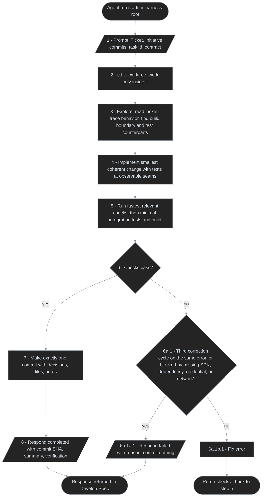
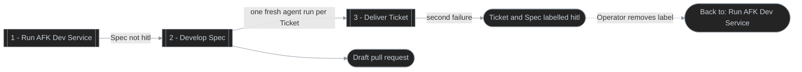

# Autonomous Spec Delivery

## Purpose
Loop delivers the approved Tickets of every open Spec to a draft pull request without an operator in the session, one fresh agent run per Ticket, and escalates a Ticket to a human once it keeps failing.

## Definition
- **Actors:** Operator; Loop (the example `dev` Workflow); Copilot agent (one fresh headless run per Ticket); GitHub.
- **Business processes:** Run AFK Dev Service; Develop Spec; Deliver Ticket.
- **Starts:** Operator runs the `dev` Workflow script (through their own alias) for a repository board.
- **Ends:** Every open Spec not labelled `hitl` was attempted; each Develop Spec run ends with its validated commits pushed and its draft pull request ensured.

## Business Processes

### Run AFK Dev Service
Actor: Operator; Trigger: the `dev` Workflow script is run for a repository board; Action: Loop lists the open Specs, skips those labelled `hitl`, and runs Develop Spec for each remaining one; Outcome: every remaining Spec was attempted. Notes: there is no dry run and no Spec-level attempt cap; failures are counted per Ticket.

### Develop Spec
Actor: Loop; Trigger: a Spec not labelled `hitl`; Action: resolve the Initiative id from the Spec title prefix and the target repository and base branch, fetch the target repository, and when no Ticket is actionable push and ensure the draft pull request and stop; when the base branch is missing on `origin` label the Spec `hitl` and stop; otherwise push earlier commits and ensure the draft pull request when ahead, create the worktree, and for each actionable Ticket record `previous_head`, render the prompt, run Deliver Ticket, then validate the response and Git; success closes the Ticket with the commit SHA, summary, and verification and resets its failure count; any failure resets the worktree to `previous_head` and counts once, retries the same Ticket until the failure cap, and at the cap labels the Ticket and the Spec `hitl` with the reason commented on both and stops; finally push and ensure the draft pull request; Outcome: all Tickets delivered — the pull request link is commented on the Spec, which stays open for the human merge — or the Spec stopped on `hitl` with its validated work pushed.

```mermaid
%%{init: {'themeVariables': {'lineColor': '#8b949e'}}}%%
%% diagram-id: develop-spec-swimlane
swimlane-beta TB
  accTitle: Develop Spec responsibility
  accDescr: Shows the whole flow of one Spec run, with Loop validating each Ticket the Copilot agent delivers and publishing results to GitHub.

  subgraph loop [Loop - dev Workflow]
    start([Spec not labelled hitl])
    meta[1 - Resolve Initiative id, target repo, base branch]
    fetch[2 - Fetch target repo]
    actionable{3 - Actionable Tickets?}
    idle[3a.1 - Push branch and ensure draft PR when ahead]
    baseOk{4 - Base branch on origin?}
    noBase[4a.1 - Label Spec hitl, comment reason]
    pre[5 - Push earlier commits and ensure draft PR when ahead]
    wt[6 - Create worktree]
    head[7 - Record previous HEAD]
    prompt[8 - Render prompt with Ticket, Initiative commits, task id, contract]
    parse[10 - Parse response envelope]
    gitCheck[11 - Check commit: HEAD moved, one commit, tagged subject, clean tree, reported SHA is HEAD]
    valid{12 - Response and commit valid?}
    close[12a.1 - Close Ticket with SHA, summary, verification]
    clear[12a.2 - Reset Ticket failure count]
    more{12a.3 - More actionable Tickets?}
    nextTicket([Next Ticket - back to step 7])
    reset[12b.1 - Reset worktree to previous HEAD]
    count[12b.2 - Count failure]
    cap{12b.3 - Failure cap reached?}
    hitl[12b.3a.1 - Label Ticket and Spec hitl, comment reason]
    retry([Retry same Ticket - back to step 7])
    publish[13 - Push branch and ensure draft PR when ahead]
    done{14 - All Tickets delivered?}
    link[14a.1 - Comment PR link on Spec]
    endNode([Spec run ended])
  end

  subgraph agent [Copilot agent - fresh run]
    run[[9 - Deliver Ticket]]
  end

  subgraph ext [External systems - GitHub]
    remote[(Target repo remote and PR)]
    issues[(Spec and Ticket issues)]
  end

  start --> meta --> fetch --> actionable
  actionable -->|none| idle --> endNode
  actionable -->|yes| baseOk
  baseOk -->|no| noBase --> endNode
  baseOk -->|yes| pre --> wt --> head --> prompt
  prompt -->|prompt| run
  run -->|response, one commit| parse --> gitCheck --> valid
  valid -->|yes| close --> clear --> more
  more -->|yes| nextTicket
  more -->|no| publish
  valid -->|no| reset --> count --> cap
  cap -->|yes| hitl --> publish
  cap -->|no| retry
  publish --> done
  done -->|yes| link --> endNode
  done -->|no| endNode
  idle -->|push, PR| remote
  pre -->|push, PR| remote
  publish -->|push, PR| remote
  noBase -->|labels, comments| issues
  close -->|close| issues
  hitl -->|labels, comments| issues
  link -->|PR link| issues

  classDef default fill:#242424,stroke:#8b949e,color:#c9d1d9,stroke-width:1px
```

### Deliver Ticket
Actor: Copilot agent (one fresh headless run per attempt, following the `dev` prompt); Trigger: Develop Spec renders the prompt with the Ticket, the Initiative's `ccode(<initiative-id>|` commits on the branch, the task id `<initiative-id>|<ticket-number>`, and the contract; Action: the agent works only inside the worktree, explores, implements the functional slice, verifies it with the fastest relevant checks, makes exactly one `ccode(<initiative-id>|<ticket-number>): <message>` commit, and ends with the response envelope; Outcome: a `completed` envelope carrying the commit SHA, summary, and verification, or a `failed` envelope carrying the reason with nothing committed. Notes: the agent never pushes, opens a pull request, or comments, labels, or closes a Ticket or Spec; Loop validates the envelope and Git and owns the Ticket state in Develop Spec. A Develop Spec failure is an agent-reported `failed`, a missing or invalid response, an `identifier` other than this Ticket's, HEAD unchanged, a non-matching subject, a dirty tree, a reported SHA other than HEAD, or a crashed or timed-out run.



## Relationships



A solid edge is automatic; a dotted edge is a separately initiated step, labelled with its initiator.

Decisions: [ADR 0009](../adr/0009-run-one-fresh-agent-per-ticket-from-python-and-let-the-agent-commit-it.md) (per-Ticket run, task commit, Git validation), [ADR 0007](../adr/0007-stream-agent-output-live-and-parse-it-after-exit-with-a-per-agent-kind-output-parser.md) (response envelope and output parser), [ADR 0006](../adr/0006-keep-commit-push-pull-request-and-ticket-state-changes-in-python.md) (Python owns push, pull request, and Ticket state).

## Implementation Map
| Concern | Stable anchor | Semantic locator |
|---|---|---|
| External contract | Operator-run service for one repository board | `workflows/dev/`: runnable package (`python -m workflows.dev`) `main(argv)`, options `--harness-root`, `--log-dir`, `--log-level` |
| Spec and Ticket selection | Open Specs; actionable Tickets | `workflows/platforms/work_tracking`: `TicketsTracker.specs`, `TicketsTracker.get_tickets` |
| Execution | Fresh non-interactive Copilot run per Ticket | `loop`: `AgentClient`, `WorktreeRunner` |
| Failure bound | Per-Ticket failure count across runs | `loop`: `ExecutionStore` |
| Tests | Workflow scenarios against fakes | `tests/unit/test_workflows.py` (unit group, fast fakes seam); shared harness in `tests/workflow_harness.py`; `tests/integration/` (integration group) |
