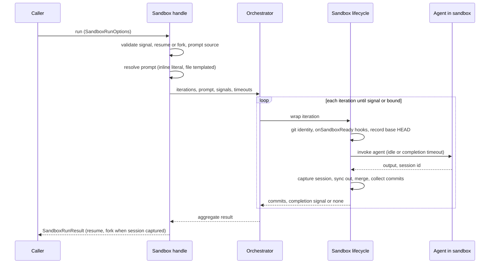

# Sandbox Run
**Type:** Architecture Pattern

## Purpose

Sandcastle's `Sandbox` handle lets a caller invoke a coding agent repeatedly inside one long-lived container and worktree without paying setup cost per call. A run must therefore define what one invocation guarantees: how the prompt is prepared, when the iteration loop stops, how work leaves the sandbox as commits, and how a later call continues the agent's session.

## Concept

A Sandbox Run is a bounded loop of fresh agent iterations executed in an already-started sandbox. Each iteration is wrapped by the sandbox lifecycle (setup, agent, sync to host, merge, commit collection), while the sandbox and worktree stay warm between runs ([research](../research/sandcastle-agent-invocation-and-extension-points.md)).

The caller owns the prompt and the stop condition; the orchestrator code, not the agent, owns the loop. The agent signals completion by emitting a string that Sandcastle detects and never injects. Whether prompt text is processed depends on its source: an inline prompt is literal, a prompt file is a template. A run returns an aggregate of all iterations, and offers continuation of the captured agent session through the result.

## Rules

- MUST reject a run whose abort signal is already aborted before any setup, and MUST surface the signal's reason verbatim on abort; the `Sandbox` handle MUST stay usable for another run after an abort.
- MUST require exactly one prompt source per run, an inline prompt or a prompt file.
- MUST deliver an inline prompt to the agent literally, with no argument substitution, shell expansion, or built-in argument injection.
- MUST process a prompt file as a template: substitute prompt arguments, inject the built-in source and target branch arguments, and reject a caller argument that overrides a built-in one.
- MUST run the iteration loop in orchestrator code, with a caller-supplied iteration bound that defaults to one iteration.
- MUST stop the loop early only when a completion signal appears in the agent's output; the prompt MUST NOT contain loop logic.
- MUST fail an iteration whose agent produces no output within the idle timeout; once a completion signal has been seen, MUST replace the idle timeout with a completion timeout that completes the iteration successfully and warns that the process is hanging.
- MUST wrap every iteration in the sandbox lifecycle so the agent's changes reach the host worktree before commits are collected.
- MUST collect commits for each iteration against the host `HEAD` recorded before that iteration, and MUST return the commits of all iterations in order.
- MUST, under the merge-to-head branch strategy, merge the temporary branch into the host's current branch after each iteration; on merge failure MUST preserve the temporary branch and report how to retry the merge.
- MUST capture the agent session to the host before the sandbox is released when the agent provider supports session storage.
- MUST offer continuation of a run (resume or fork) only when the provider supports session storage and a session id was captured on the last iteration.
- MUST execute a resume or fork as exactly one iteration through the same run path; MUST reject a resume session combined with more than one iteration, a fork without a resume session, and a resume session whose captured file is missing on the host.
- MUST NOT treat a fork as branch or sandbox isolation; concurrent forks are safe only when each has a distinct branch.
- MUST return per-iteration results, the matched completion signal if any, combined output, commits, and the log file path when logging to a file.

## Example

## Benefits and Trade-offs

**Benefits**

- Warm container and worktree make follow-up runs cheap, including resume and fork.
- Code-owned loop and stop condition keep termination independent of agent behavior.
- Literal inline prompts stay safe for programmatically embedded content such as issue bodies.

**Trade-offs**

- A completion signal is detected by substring in the output, so a signal quoted by the agent can end the loop.
- Fork isolates only the session, not the working directory or merge target.
- Concurrent runs on one named branch are not prevented by locking in the current code.

## Validation

Orchestrator tests cover iteration bounds, completion-signal stop, abort, completion timeout, and session capture; lifecycle tests cover merge conflicts preserving the temporary branch and merging diverged host branches; sandbox handle tests cover run, resume, and fork validation.

## References

- [Sandcastle agent invocation and extension points](../research/sandcastle-agent-invocation-and-extension-points.md)
- [Sandcastle worktrees and tasks](../research/sandcastle-worktrees-and-tasks.md)
- [Sandcastle prompts and instructions](../research/sandcastle-prompts-and-instructions.md)

## Implementation Map

| Concern | Stable anchor | Semantic locator |
|---|---|---|
| External contract | Caller-visible run on a started sandbox, with its options and aggregate result | `sandcastle`: `Sandbox`, `SandboxRunOptions`, `SandboxRunResult`, `ResumeSandboxRunResultOptions` |
| Prompt preparation | Inline literal versus templated prompt-file rule | `sandcastle`: `PromptResolver`, `PromptArgumentSubstitution`, `BUILT_IN_PROMPT_ARG_KEYS`, `PromptPreprocessor` |
| Iteration loop | Orchestrator-owned bounded loop with completion signal and timeouts | `sandcastle`: `Orchestrator`, `OrchestrateOptions`, `OrchestrateResult`, `AgentIdleTimeoutError` |
| Per-iteration lifecycle | Setup, sync to host, merge, commit collection around the agent | `sandcastle`: `SandboxLifecycle`, `SandboxLifecycleOptions`, `SandboxHooks` |
| Session continuation | Captured agent session enabling resume and fork | `sandcastle`: `AgentSessionStorage`, `SessionCaptureError`, `IterationResult` |
| Tests | Loop, abort, timeout, merge, and session behavior | `sandcastle`: `Orchestrator.test`, `SandboxLifecycle.test`, `createSandbox.test` |
