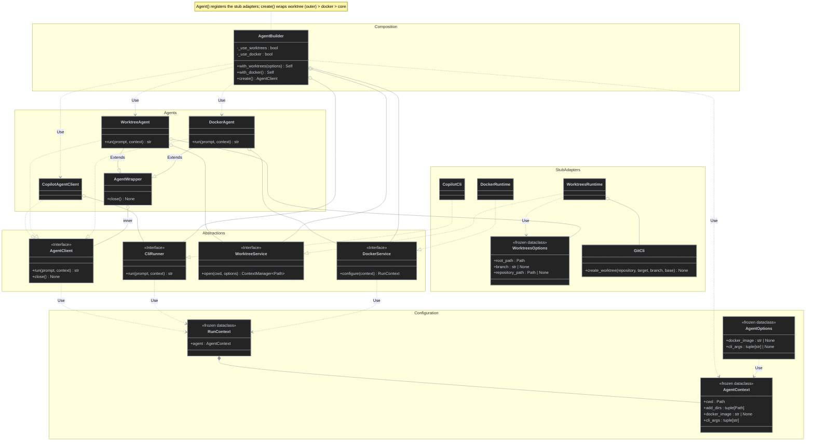

# Agent builder + execution decorators (contract prototype)

A standalone Python sketch of a fluent agent composition API. `Agent()` registers private dependencies and returns a builder. `create()` returns an `AgentClient` interface; decorators compose optional execution behavior without changing `run()` or `close()`.

## Usage

```python
from agent import Agent

# Default: concrete CopilotAgentClient (no wrappers)
agent = Agent().create()

# One fluent chain: WorktreeAgent -> DockerAgent -> CopilotAgentClient
agent = Agent().with_worktrees().with_docker().create()

try:
    result = agent.run("Implement ticket #123")
    print(result)
finally:
    agent.close()
```

Run locally from the prototype directory:

```sh
cd docs/prototypes/agent-builder
python agent.py
python -m unittest discover -s . -p 'test_*.py'
```

Python 3.12+, standard library only. No real Git, Docker, or Copilot installation required.

## Contracts

- `Agent(options: AgentOptions | None = None) -> AgentBuilder`: *composition root*; registers `CopilotCli`, `WorktreesRuntime(GitCli())`, and `DockerRuntime` internally.
- `WorktreesOptions`: `root_path` (worktrees root, must resolve inside the cwd) and `branch` (new branch name; unset generates `feat_<hex>` per run); the worktree is created at `root_path/branch`. `repository_path` (optional, default the agent `cwd`; relative paths resolve from it) sets `git -C` for multi-repository setups.
- `GitCli.create_worktree(repository, target, branch, base="main")`: with `git -C <repository>`: `fetch --all --prune`, `check-ref-format --branch`, `branch` (or `branch -f` when it exists locally) from `origin/<branch>` if present else `origin/<base>`, then `worktree add <target> <branch>`.
- `AgentOptions`: optional frozen caller overrides `docker_image` and `cli_args`; `Agent()` copies the set (non-`None`) values onto the `AgentContext`.
- `AgentBuilder.with_worktrees(options: WorktreesOptions | None = None) -> Self`: enable per-run worktree scope; defaults to `WorktreesOptions()`.
- `AgentBuilder.with_docker() -> Self`: enable Docker execution configuration.
- `AgentBuilder.create() -> AgentClient`: create a new composed client; no wrapper when no options enabled.
- `AgentClient.run(prompt: str, context: RunContext | None = None) -> str`: invariant public entry point.
- `AgentContext`: frozen agent settings `cwd`, `docker_image`, `cli_args` (default `("--allow-all-tools",)`) and `add_dirs` (each passed as `--add-dir`); the agent always starts in `cwd` (the harness dir) and `WorktreeAgent` adds the created worktree to `add_dirs`. `Agent()` creates it and the builder seeds the default `RunContext` with it.
- `RunContext`: per-run context; carries the `AgentContext` as `agent` (no `cwd`/`docker_image` of its own).
- `AgentClient.close() -> None`: lifecycle operation delegated through all wrappers.
- `CliRunner`, `WorktreeService`, `DockerService`: narrow dependency protocols. The builder accepts their implementations; callers of `Agent()` do not see them.

## Class diagram



## Multi-repository example

`repo_agent(repo, branch=None)` builds one worktree-isolated agent for `workspace/<repo>`, with worktrees in `workspace/<repo>.worktrees`. Run it from the harness dir, which is the agent `cwd`.

```python
agent = repo_agent("repo1")  # branch unset: generates feat_<hex>
agent.run("Implement ticket #123 in repo1")
```

It is equivalent to:

```python
Agent().with_worktrees(WorktreesOptions(
    root_path=Path("workspace/repo1.worktrees"),
    repository_path=Path("workspace/repo1"),
)).with_docker().create()
```

Resulting folder structure after one run (`feat_1a2b3c4d` is the generated branch):

```text
<harness>/                          # agent cwd (the agent starts here)
├── .git
└── workspace/
    ├── repo1/                      # repository_path -> git -C target
    │   └── .git                    # holds branch feat_1a2b3c4d and worktree metadata
    ├── repo1.worktrees/            # root_path
    │   └── feat_1a2b3c4d/          # target = root_path/branch
    │       ├── .git                # file pointing back to repo1/.git/worktrees/feat_1a2b3c4d
    │       └── ...                 # checkout of branch feat_1a2b3c4d, from origin/main
    ├── repo2/
    │   └── .git
    └── repo2.worktrees/            # created on the first repo2 run
```

The agent runs with `cwd=<harness>` and `--add-dir <harness>/workspace/repo1.worktrees/feat_1a2b3c4d`. Each run adds a new `feat_<hex>` directory; nothing removes them. An explicit branch such as `loop/ticket-123` adds a directory level (`repo1.worktrees/loop/ticket-123/`). One agent covers one repository; a second `with_worktrees()` call replaces the first.

## Delegation order

```text
Agent().create()
  CopilotAgentClient.run()
    -> CliRunner.run()

Agent().with_worktrees().with_docker().create()
  WorktreeAgent.run()
    -> WorktreeService.open() [enter]
    -> DockerAgent.run()
      -> DockerService.configure()
      -> CopilotAgentClient.run()
        -> CliRunner.run()
    -> WorktreeService.open() [exit even on error]
```

`with_worktrees()` and `with_docker()` set builder flags; `create()` establishes the fixed wrapper order **worktree (outer) -> Docker (inner) -> core**. Calls preserve prompt and context, replacing only the Docker setting and appending the worktree to `add_dirs` (`cwd` is unchanged). `close()` forwards to the innermost client.

## Prototype boundaries

**`CopilotCli` and `DockerRuntime` are stubs, not real container or Copilot execution.** `WorktreesRuntime` is real: it runs git through `GitCli` (fetch, branch, `worktree add`) against the repository at `repository_path` (default: the agent cwd) and leaves the worktree in place afterwards. `DockerRuntime.configure()` adds a Docker image to the context without running a container, and `CopilotCli.run()` returns descriptive text without invoking Copilot. Tests drive `GitCli` with a fake process runner, so no git is run; they verify composition and command contracts only.

Production integration with `loop` would replace these adapters and align the sketch's `run(str) -> str` / `close()` with the repository's actual `AgentClient.run(Prompt, model, reasoning_effort, AgentOptions) -> AgentResult` / `exit()` contract (`src/loop/contracts/agent_client.py`). In particular, a real Docker-capable runner must mount the newly created worktree and run the CLI inside the container. No production source files are changed by this prototype.
