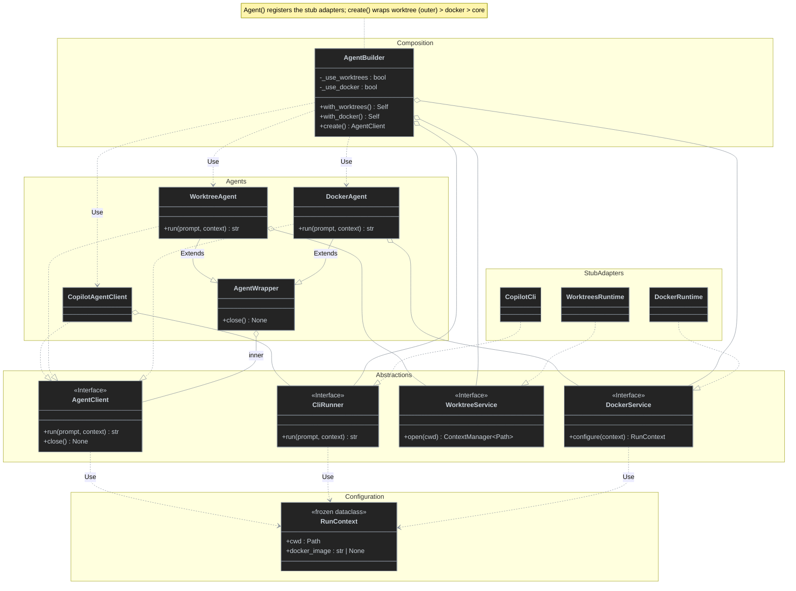

# Agent builder + execution decorators (contract prototype)

A standalone Python sketch of a fluent agent composition API. `Agent()` registers private dependencies and returns a builder. `create()` returns an `AgentClient` interface; decorators compose optional execution behavior without changing `run()` or `close()`.

## Usage

```python
from agent import Agent

# Default: concrete CopilotAgentClient (no wrappers)
agent = Agent().create()

# One fluent chain: WorktreeAgent -> DockerAgent -> CopilotAgentClient
agent = Agent().with_worktrees().with_docker().create()

try:
    result = agent.run("Implement ticket #123")
    print(result)
finally:
    agent.close()
```

Run locally from the prototype directory:

```sh
cd docs/prototypes/agent-builder
python agent.py
python -m unittest discover -s . -p 'test_*.py'
```

Python 3.12+, standard library only. No real Git, Docker, or Copilot installation required.

## Contracts

- `Agent() -> AgentBuilder`: *composition root*; registers `CopilotCli`, `WorktreesRuntime`, and `DockerRuntime` internally.
- `AgentBuilder.with_worktrees() -> Self`: enable per-run worktree scope.
- `AgentBuilder.with_docker() -> Self`: enable Docker execution configuration.
- `AgentBuilder.create() -> AgentClient`: create a new composed client; no wrapper when no options enabled.
- `AgentClient.run(prompt: str, context: RunContext | None = None) -> str`: invariant public entry point.
- `AgentClient.close() -> None`: lifecycle operation delegated through all wrappers.
- `CliRunner`, `WorktreeService`, `DockerService`: narrow dependency protocols. The builder accepts their implementations; callers of `Agent()` do not see them.

## Class diagram



## Delegation order

```text
Agent().create()
  CopilotAgentClient.run()
    -> CliRunner.run()

Agent().with_worktrees().with_docker().create()
  WorktreeAgent.run()
    -> WorktreeService.open() [enter]
    -> DockerAgent.run()
      -> DockerService.configure()
      -> CopilotAgentClient.run()
        -> CliRunner.run()
    -> WorktreeService.open() [exit even on error]
```

`with_worktrees()` and `with_docker()` set builder flags; `create()` establishes the fixed wrapper order **worktree (outer) -> Docker (inner) -> core**. Calls preserve prompt and context, replacing only the workspace path and Docker setting. `close()` forwards to the innermost client.

## Prototype boundaries

**These are stubs, not real worktree or container execution.** `WorktreesRuntime.open()` yields a synthetic path without creating a worktree, `DockerRuntime.configure()` adds a Docker image to the context without running a container, and `CopilotCli.run()` returns descriptive text without invoking Copilot. Tests verify composition and cleanup contracts only.

Production integration with `loop` would replace these adapters and align the sketch's `run(str) -> str` / `close()` with the repository's actual `AgentClient.run(Prompt, model, reasoning_effort, AgentOptions) -> AgentResult` / `exit()` contract (`src/loop/contracts/agent_client.py`). In particular, a real Docker-capable runner must mount the newly created worktree and run the CLI inside the container. No production source files are changed by this prototype.
