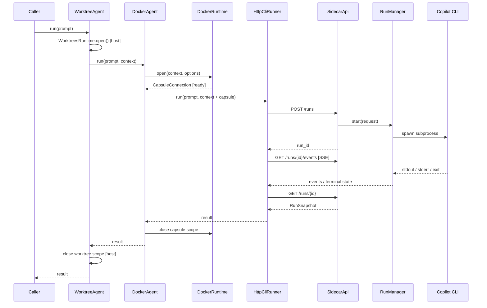
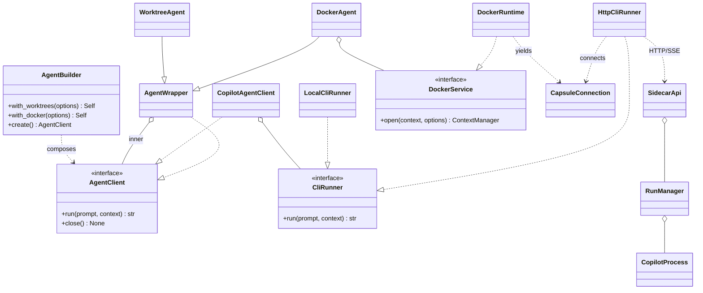

# Docker HTTP sidecar for the Agent builder (Option A)

**Status:** proposed contracts; documentation only. No implementation changes.

**Base:** [Agent builder prototype](./README.md) and [agent.py](./agent.py).

## Goal

Keep the `AgentClient` and orchestration on the **host**, but execute **Copilot CLI inside Docker**. A Python HTTP sidecar runs **in the same container as Copilot CLI** (Option A). The host communicates with the sidecar over HTTP; the sidecar owns the Copilot subprocess.

`Agent().create()` remains local. `Agent().with_docker().create()` selects Docker + HTTP. Worktree composition stays unchanged.

## Usage (contract only)

```python
local = Agent().create()

docker = Agent().with_docker().create()

isolated = (
    Agent()
    .with_worktrees(WorktreesOptions(repository_path=Path("workspace/repo1"),
                                     root_path=Path("workspace/repo1.worktrees")))
    .with_docker()
    .create()
)

try:
    result = isolated.run("Implement ticket #123")
finally:
    isolated.close()
```

`run(prompt, context=None) -> str` and `close() -> None` stay invariant for this prototype. The production `AgentClient` has a different signature returning `AgentResult`; adaptation is a separate integration step.

## Boundaries

```text
HOST (Loop)                                      DOCKER: one capsule per run
┌────────────────────────────────────┐           ┌───────────────────────────────┐
│ AgentBuilder                       │           │ Python HTTP sidecar           │
│ WorktreeAgent                      │           │  SidecarApi                   │
│   └─ DockerAgent                   │           │    └─ RunManager              │
│        └─ CopilotAgentClient       │  HTTP/SSE │         └─ CopilotProcess     │
│             └─ HttpCliRunner ──────┼──────────►│                  │            │
│ DockerRuntime (container lifecycle)│           │              Copilot CLI      │
│ WorktreesRuntime (host Git)        │           │                  │            │
│                                    │           │              /harness         │
└────────────────────────────────────┘           └───────────────────────────────┘
                         shared bind mount: <host harness> → /harness
```

- **Host:** owns ticket selection, prompt preparation, Git/worktrees, Docker lifecycle, result handling, and `AgentClient` interface.
- **DockerRuntime:** launches/removes a container with sidecar + Copilot, binds the harness, publishes a temporary local HTTP port, waits for readiness, returns its connection.
- **HttpCliRunner:** sends requests, reads SSE output, resolves terminal result, requests cancellation on timeout.
- **SidecarApi:** translates HTTP operations into `RunManager` operations; it does not proxy raw bytes into the CLI's stdin.
- **RunManager / CopilotProcess:** validates the request, starts/manages the subprocess, captures output, tracks status, terminates the process on cancellation.

**One capsule per agent run, one CLI execution per capsule** for the initial design. No persistent sidecar, sessions across containers, remote Docker host, or multi-run concurrency in scope.

## Contracts (Python signatures, not implementations)

Existing names are retained; changed/new fields and methods are proposals.

```python
from collections.abc import AsyncIterator
from contextlib import AbstractContextManager
from dataclasses import dataclass
from pathlib import Path
from typing import Literal, Protocol, Self


@dataclass(frozen=True)
class DockerOptions:
    container_cwd: str = "/harness"
    sidecar_port: int = 8080                 # internal port; host port chosen dynamically
    startup_timeout_s: float = 30.0


@dataclass(frozen=True)
class CapsuleConnection:
    base_url: str                           # host-visible http://127.0.0.1:<ephemeral-port>
    auth_token: str                         # per-capsule secret
    container_cwd: str                      # e.g. /harness


@dataclass(frozen=True)
class RunContext:
    agent: AgentContext                     # existing host-side settings
    capsule: CapsuleConnection | None = None


class AgentClient(Protocol):
    def run(self, prompt: str, context: RunContext | None = None) -> str: ...
    def close(self) -> None: ...


class CliRunner(Protocol):
    def run(self, prompt: str, context: RunContext) -> str: ...


class LocalCliRunner(CliRunner): ...         # existing CopilotCli adapter
class HttpCliRunner(CliRunner): ...          # NEW: host HTTP/SSE client


class DockerService(Protocol):
    def open(
        self, context: RunContext, options: DockerOptions
    ) -> AbstractContextManager[CapsuleConnection]: ...


class DockerRuntime(DockerService): ...     # NEW real runtime replaces configure() stub


class DockerAgent(AgentWrapper):
    def run(self, prompt: str, context: RunContext | None = None) -> str: ...


class AgentBuilder:
    def with_worktrees(self, options: WorktreesOptions | None = None) -> Self: ...
    def with_docker(self, options: DockerOptions | None = None) -> Self: ...
    def create(self) -> AgentClient: ...


def Agent(options: AgentOptions | None = None) -> AgentBuilder: ...
```

**Composition rule in `create()`:**

| Builder | Core runner | Wrappers (outer → inner) |
| --- | --- | --- |
| `Agent().create()` | `LocalCliRunner` | none |
| `Agent().with_docker().create()` | `HttpCliRunner` | `DockerAgent` |
| `Agent().with_worktrees().create()` | `LocalCliRunner` | `WorktreeAgent` |
| `Agent().with_worktrees().with_docker().create()` | `HttpCliRunner` | `WorktreeAgent → DockerAgent` |

`DockerAgent.run()` enters `DockerService.open()`, adds `CapsuleConnection` to a copy of `RunContext`, delegates to the inner client, then exits the Docker scope even on failure. **It does not call a local Copilot CLI.** The builder selects `HttpCliRunner` when Docker is enabled.

`AgentContext.cwd` remains a **host path**; the sidecar receives `CapsuleConnection.container_cwd` instead. Existing `AgentOptions.docker_image` remains the image source; do not duplicate image configuration in `DockerOptions`.

### Sidecar-side contracts

```python
RunState = Literal["queued", "running", "completed", "failed", "cancelled", "timed_out"]


@dataclass(frozen=True)
class StartRunRequest:
    request_id: str                         # idempotency key
    prompt: str
    cwd: str                                # container-only path
    cli_args: tuple[str, ...]
    add_dirs: tuple[str, ...] = ()         # mapped container paths
    timeout_s: float | None = None


@dataclass(frozen=True)
class RunAccepted:
    run_id: str
    state: RunState


@dataclass(frozen=True)
class RunSnapshot:
    run_id: str
    state: RunState
    exit_code: int | None
    stdout: str
    stderr: str
    result: str | None                     # final agent output (if available)
    error: str | None


@dataclass(frozen=True)
class RunEvent:
    event_id: int
    kind: Literal["stdout", "stderr", "state", "result"]
    data: str


class RunManager(Protocol):
    def start(self, request: StartRunRequest) -> RunAccepted: ...
    def get(self, run_id: str) -> RunSnapshot: ...
    def events(self, run_id: str, after_id: int = 0) -> AsyncIterator[RunEvent]: ...
    def cancel(self, run_id: str) -> None: ...


class CopilotProcess(Protocol):
    def start(self, request: StartRunRequest) -> None: ...
    def terminate(self) -> None: ...
```

`SidecarApi` is the HTTP adapter over `RunManager`, not a second Copilot client. Internal process tracking may use additional fields; the types above define the boundary.

## HTTP API

All operations except `/health` require the capsule token. The sidecar binds its internal interface for the published port; **Docker publishes to `127.0.0.1` on the host**, not a public interface.

| Method | Path | Request / response |
| --- | --- | --- |
| `GET` | `/health` | readiness, only after manager is initialized |
| `POST` | `/runs` | `StartRunRequest` → `202 RunAccepted` |
| `GET` | `/runs/{run_id}` | `RunSnapshot` |
| `GET` | `/runs/{run_id}/events` | SSE stream of `RunEvent`; optional `Last-Event-ID` |
| `DELETE` | `/runs/{run_id}` | request cancellation; repeatable |

Example request:

```http
POST /runs
Authorization: Bearer <capsule-token>
Content-Type: application/json

{
  "request_id": "ticket-123-attempt-1",
  "prompt": "Implement ticket #123",
  "cwd": "/harness",
  "cli_args": ["--allow-all-tools"],
  "add_dirs": [],
  "timeout_s": 1800
}
```

The runner waits for a terminal state. `completed` means Copilot exited successfully; `failed` includes nonzero exit or execution error; `cancelled` is explicit interruption; `timed_out` is the sidecar-enforced timeout. A lost SSE connection does **not** imply execution failed: reconnect/read `GET /runs/{id}` before retrying. Repeated `POST` with the same `request_id` MUST NOT launch another CLI process.

The prototype's `str` return comes from the completed snapshot's `result` (or captured stdout when no structured result is available). Non-success states raise an execution error rather than returning a success string.

## Runtime sequence



The same cleanup order applies on errors: **cancel/stop subprocess → stop container → release worktree**. Worktree removal still follows the base prototype's Git safety: if uncommitted changes prevent removal, surface that failure; never force-delete user work.

## Filesystem and trust boundary

```text
<host harness>/                           /harness/ (container)
├── .github/                      ─────►  ├── .github/
├── workspace/                    ─────►  ├── workspace/
│   ├── repo1/.git                         │   ├── repo1/.git
│   └── repo1.worktrees/                   │   └── repo1.worktrees/
│       └── feat_abc/                      │       └── feat_abc/
└── ...                                    └── ...
```

- Bind mount **the complete harness root** read/write at `/harness`; the agent runs from `/harness` and can read its `.github` skills/instructions.
- Mount the original repository **and** linked worktrees at consistent relative paths. Git worktree metadata may refer back to the original `.git`; mounting only the worktree breaks those references.
- Translate `add_dirs` to container paths or reject unmapped paths. Do not send raw host paths as subprocess `cwd` or `--add-dir`.
- Give the container only necessary files, Git credentials and Copilot authentication. Never mount the Docker socket in the sidecar.
- Restrict sidecar execution to the configured CLI and permitted directories; do not provide a generic shell-command HTTP endpoint.
- Use a random per-capsule token, loopback-only host publication, and explicit process/container timeouts. Secrets must not appear in logs or returned events.

## Class relationships



## Changes relative to the base prototype

1. **Keep:** `Agent()` dependency-registration factory, fluent builder, `AgentClient`, `AgentWrapper`, `WorktreeAgent`, host `WorktreesRuntime`, wrapper order, `run()/close()`.
2. **Replace:** `DockerService.configure(context)` (stub only sets image) with scoped `DockerService.open(context, options)` that actually owns a container.
3. **Add:** `HttpCliRunner`, `CapsuleConnection`, `DockerOptions`, optional `RunContext.capsule`, sidecar API and process manager.
4. **Select transport in builder:** local `CopilotCli` or Docker `HttpCliRunner`; Docker execution must never fall through to the host's local runner.
5. **Defer:** mapping the separate production `Prompt` / `AgentOptions` / `AgentResult` / `exit()` contract, streamed structured result parsing, and persistent multi-run sessions.

**Acceptance contract:** local mode needs no Docker; Docker mode starts one capsule, uses HTTP rather than host Copilot, exposes host-created worktrees and harness instructions, yields the same `AgentClient` response shape, and cleans up process/container/worktree on both success and failure.
