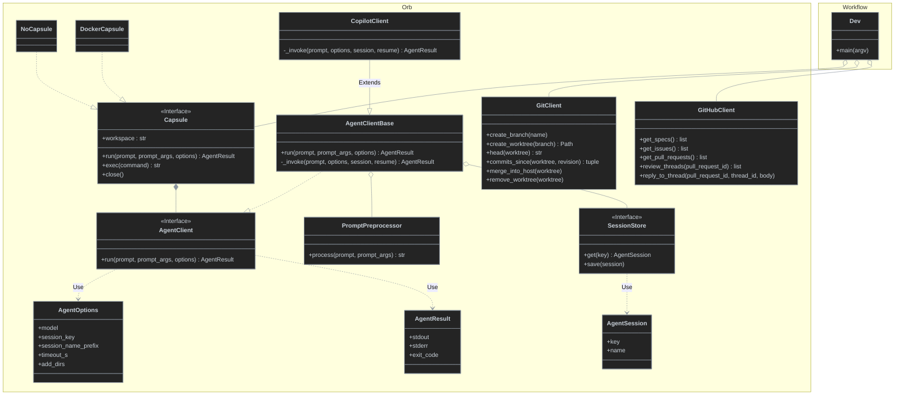

# prot2

Prototype for composing agent workflows on capsules. A workflow is an ordinary Python script that imports only from `orb`, wires a capsule, git and GitHub clients, and owns its own control flow. Implementations run against fakes at the process boundary (`FakeCopilotCli`, `FakeDocker`, `FakeGh`, `FakeGitClient`, `FakeAgentClient`).

- `NoCapsule` runs the agent in the workspace with no sandbox.
- `DockerCapsule` starts a container and runs the agent's commands inside it with `docker exec`.
- The agent receives the prompt, the prompt args used to render it, and options (configuration, including `session_key`).
- `PromptPreprocessor` replaces `${{KEY}}` placeholders; a template-authored !`cmd` runs through the capsule's executor.

## Class diagram



## Run

```
pip install -e .
pytest
```
