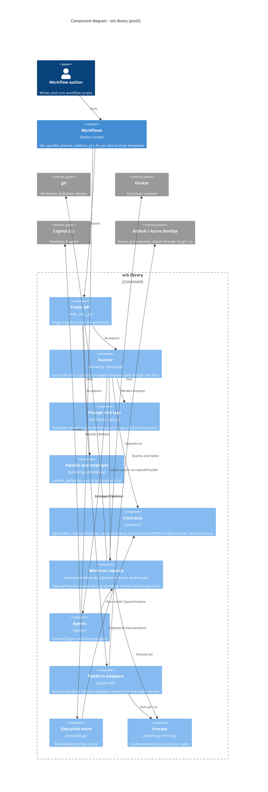

# prot2

Library for composing agent workflows on git worktree capsules. A workflow is an ordinary Python script that imports only from `orb` and owns its own control flow.

## Component diagram



## Run

```
pip install -e .
pytest
```
