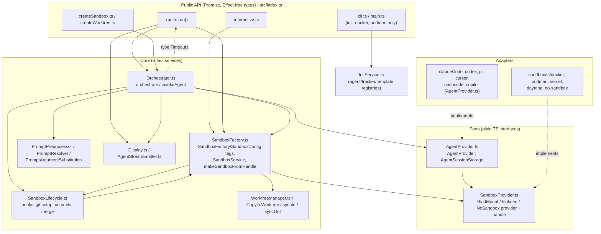

# Sandcastle: agent invocation from the CLIs and extension points

Source: https://github.com/mattpocock/sandcastle @ `e99f832f26dc9d245c019a9ddd19fa5dee792427` (shallow clone, read 2026-10-02). All `src/...` citations are repo-relative to sandcastle.

## Summary

- **The `sandcastle` CLI does not run agents.** It only has `init`, `docker build-image|remove-image` and `podman build-image|remove-image` (`src/cli.ts:L692-L694`). You start agent runs through the **programmatic API**: a user-owned `.sandcastle/main.mts` calls `run()` and is executed with `npx tsx` (`src/templates/simple-loop/main.mts:L1-L8`).
- **Process model:** each iteration builds **one shell command string** per agent (`AgentProvider.buildPrintCommand`). That string goes to a sandbox handle's `exec()`, which runs `docker exec [-i] [-w cwd] <container> sh -c "<cmd>"` (`src/sandboxes/docker.ts:L259-L266`) or `sh -c "<cmd>"` on the host for no-sandbox (`src/sandboxes/no-sandbox.ts:L73-L79`). The prompt is piped on stdin where the CLI supports it. Otherwise it is passed as argv, with a guard at 120 KiB.
- **Output parsing:** stdout is split into lines with `readline`. Each line goes to the provider's `parseStreamLine()`, which returns `text | result | tool_call | session_id | usage` events (`src/AgentProvider.ts:L34-L39`). stderr is only buffered (bounded tail).
- **Success and failure:** a non-zero exit code becomes `AgentError`, with the detail taken from stderr, then the last `result` event, then the last 20 stdout lines (`src/Orchestrator.ts:L191-L206`). A **completion signal** substring (default `<promise>COMPLETE</promise>`) ends the iteration loop early (`src/Orchestrator.ts:L246`, `L548-L550`). Otherwise the loop stops after `maxIterations` (default 1, `src/run.ts:L91`).
- **Timeouts:** an idle timeout fires after 600 s without output and fails the run. A 60 s completion timeout runs after the signal is seen and resolves successfully. Both are raced against the exec using Effect `Deferred` + `raceFirst` (`src/Orchestrator.ts:L224-L231`, `L246-L248`). Each lifecycle step also has its own timeout.
- **Layering:** the `src/` directory is flat. Effect `Context.Tag` services (`SandboxFactory`, `SandboxConfig`, `Display`, `AgentStreamEmitter`) are wired with `Layer`s at the composition root in `run()`. A build script enforces that **public types stay Promise-based and Effect-free** (`scripts/check-public-types-effect-free.mjs:L1-L8`).
- **Two first-class ports:** `AgentProvider` (`src/AgentProvider.ts:L264`) and `SandboxProvider` (bind-mount / isolated / none, `src/SandboxProvider.ts:L297`). Both are plain object interfaces, and the public API exports them so users can supply their own.
- **Other seams:** lifecycle hooks (`SandboxHooks`), the logging and stream callback (`LoggingOption.onAgentStreamEvent`), structured output (`Output.object/string`), prompt args and `` !`cmd` `` shell expansion (this is how tasks are sourced), `.sandcastle/.env`, `AbortSignal`, and `Timeouts`.

## Agent invocation

### Entry points

| Entry | File | Notes |
|---|---|---|
| `sandcastle` CLI | `src/main.ts:L16-L21`, `src/cli.ts:L684-L699` | `@effect/cli`. Subcommands are only `init`, `docker`, `podman` (`src/cli.ts:L692-L694`). No `run` command. |
| `run(options)` | `src/run.ts:L493` | The AFK loop, used from user scripts. |
| `interactive(options)` | `src/interactive.ts:L114` | Attaches a TTY through `buildInteractiveArgs` + `interactiveExec` (`src/interactive.ts:L150-L153`, `L353-L360`, `L396-L398`). |
| `createSandbox()` / `createWorktree()` | `src/createSandbox.ts:L904`, `src/createWorktree.ts:L215` | Reusable sandbox or worktree handles exposing `.run()`/`.interactive()` (`Sandbox` `src/createSandbox.ts:L224`, `Worktree` `src/createWorktree.ts:L191`). |

`sandcastle init` only **scaffolds**. It picks an agent from an internal registry (`AGENT_REGISTRY`, `src/InitService.ts:L409-L476`), writes a Dockerfile that installs that agent's CLI, an `.env.example`, a prompt and a `main.mts` from a template. The scaffolded script then calls `run({ agent: claudeCode(...), sandbox: docker(), promptFile, maxIterations, ... })` (`src/templates/simple-loop/main.mts:L8-L50`).

### Call chain for one iteration

1. `run()` validates options, resolves the cwd, prompt, env and branch, builds the Effect layers, then calls `orchestrate()` (`src/run.ts:L582-L631`, `L665-L699`, `L741`).
2. `orchestrate()` loops `for (let i = 1; i <= iterations; i++)` (`src/Orchestrator.ts:L355`). Each iteration acquires a fresh sandbox through `SandboxFactory.withSandbox` and wraps the work in `withSandboxLifecycle`, which handles git setup, hooks, commit collection and merge (`src/SandboxLifecycle.ts:L178`).
3. It runs prompt expansion inside the sandbox (`` !`cmd` `` blocks run in parallel with a 30 s timeout each; `src/PromptPreprocessor.ts:L7`, `L23-L54`).
4. `invokeAgent()` (`src/Orchestrator.ts:L22`) calls `provider.buildPrintCommand({ prompt, dangerouslySkipPermissions: true, resumeSession, forkSession })` (`src/Orchestrator.ts:L141-L146`), then `sandbox.exec(cmd.command, { onLine, cwd, stdin: cmd.stdin })` (`src/Orchestrator.ts:L147`, `L185-L187`).
5. The sandbox handle spawns the process:
   - Docker: `spawn("docker", ["exec", "-i"?, "-w", cwd?, container, "sh", "-c", cmd])`. stdin is piped only when `stdin` is set, then written and closed (`src/sandboxes/docker.ts:L259-L277`). The container itself runs `ENTRYPOINT ["sleep","infinity"]` and stays long-lived (`src/InitService.ts:L239`).
   - No-sandbox: `spawn("sh", ["-c", cmd])`, or `cmd.exe /d /s /c` on Windows (`src/sandboxes/no-sandbox.ts:L73-L88`).
   - `sudo` is a prefix for docker (`src/sandboxes/docker.ts:L259`) and a no-op on the host (`src/sandboxes/no-sandbox.ts:L66`).
6. stdout goes through `readline`, and each line is passed to `onLine`. stdout and stderr are both kept as a bounded tail (default 64 KiB) to avoid V8 string overflow (`src/sandboxes/docker.ts:L283-L301`; `src/sandboxes/no-sandbox.ts:L24-L33`, `L99-L115`). The provider contract **requires** real line-streaming, because idle timeouts depend on it (`src/SandboxProvider.ts:L28-L37`).

### Exact commands per agent provider (`buildPrintCommand`)

`dangerouslySkipPermissions` is hard-coded to `true` for AFK runs (`src/Orchestrator.ts:L143`). In `interactive()` it is `sandboxProvider.tag !== "none"`, so the bypass is dropped on the host (`src/interactive.ts:L398`).

| Provider | Command (print mode) | Prompt via | Permission flag | Resume / fork | Source |
|---|---|---|---|---|---|
| `claudeCode(model, opts)` | `claude --print --verbose [perm] --output-format stream-json --model M [--effort E] [--resume ID] [--fork-session] -p -` | stdin | `--dangerously-skip-permissions`, or `--permission-mode X` when `opts.permissionMode` is set (mutually exclusive) | yes (`--resume`, `--fork-session`) | `src/AgentProvider.ts:L1181-L1216`, `L1196-L1202` |
| `codex(model, opts)` | `codex exec [resume ID \| fork ID] --json [perm] -m M [-c model_reasoning_effort="E"] [-]` | stdin (`-` on resume) | `--dangerously-bypass-approvals-and-sandbox`, or `-a on-request -s danger-full-access -c approvals_reviewer="auto_review"` | yes (verb-level) | `src/AgentProvider.ts:L773-L814`, `L797` |
| `pi(model, opts)` | `pi -p --mode json --model M [--thinking T] [--session ID]` | stdin | none | yes (`--session`) | `src/AgentProvider.ts:L628-L654` |
| `cursor(model)` | `agent --print --output-format stream-json --model M [--force] '<prompt>'` | argv (≤120 KiB guard) | `--force` | ignored | `src/AgentProvider.ts:L128-L135`, `L837-L858` |
| `opencode(model, opts)` | `opencode run --format json --model M [--variant V] [--agent A] [--dangerously-skip-permissions] '<prompt>'` | argv | `--dangerously-skip-permissions` | ignored | `src/AgentProvider.ts:L959-L983` |
| `copilot(model, opts)` | `copilot -p '<prompt>' --output-format json --model M [--allow-all-tools] [--effort E]` | argv (≤120 KiB guard) | `--allow-all-tools` | ignored (session state lives in SQLite; ADR 0016) | `src/AgentProvider.ts:L1011-L1020`, `L1109-L1134` |

Arguments are escaped by `shellEscape` (single-quote wrapping, `src/AgentProvider.ts:L41`). The interactive form for Copilot is `copilot --model M -i '<prompt>'`, using `-i` rather than `-p` so the TUI stays open (`src/AgentProvider.ts:L1135-L1145`).

### Stream parsing

- The common event union is `ParsedStreamEvent = text | result | tool_call | session_id | usage` (`src/AgentProvider.ts:L34-L39`). Lines that do not start with `{` or are not valid JSON are dropped silently in every parser (for example `src/AgentProvider.ts:L67-L68`).
- **Claude stream-json:** `assistant` content blocks map to `text` and allowlisted `tool_use` (`Bash`, `WebSearch`, `WebFetch`, `Agent` → one display arg; `src/AgentProvider.ts:L44-L49`). `type:"result"` maps to `result`, and `system/init.session_id` maps to `session_id` (`src/AgentProvider.ts:L67-L122`).
- **Copilot JSONL:** `assistant.message_delta` → `text`, `tool.execution_start` → `tool_call` (lower-case `bash` is normalised to `Bash`), `assistant.message` → `result` (last write wins), `result.sessionId` → `session_id`, and `error`/`agent_error` → `result` (`src/AgentProvider.ts:L1022-L1099`).
- **Codex / Pi / OpenCode** report errors on **stdout** as JSON. These are mapped to `result` events so they can still be shown to the user when stderr is empty (`src/AgentProvider.ts:L578-L584`, `L730-L736`, `L930-L936`). Codex `turn.completed` maps to `usage` (`src/AgentProvider.ts:L739-L742`).
- **Orchestrator side:** every raw line is first forwarded to `onRawLine` (used by verbose mode and stream forwarders), then parsed. `text` and `result` are appended to an accumulator. The last `result` wins. Tool calls go to `Display` and `AgentStreamEmitter` (`src/Orchestrator.ts:L148-L177`). Text deltas are buffered into readable chunks by `TextDeltaBuffer` (`src/Orchestrator.ts:L420-L430`).
- **Token usage:** comes from `usage` stream events, or (Claude only) from `parseSessionUsage` over the captured session JSONL after the run (`src/AgentProvider.ts:L1238-L1266`; `src/Orchestrator.ts:L503-L545`).

### Completion, success, failure

- **Exit code:** `exitCode !== 0` produces `AgentError("<name> exited with code N:\n<detail>")`. The detail is stderr, then the last `result`, then the last 20 non-empty stdout lines (`src/Orchestrator.ts:L191-L206`). A successful run returns `resultText || stdout` (`src/Orchestrator.ts:L209`).
- **Completion signal (sentinel):** a substring match against the accumulated text and result output. The default is `<promise>COMPLETE</promise>`, and it accepts a string or an array (`src/Orchestrator.ts:L246`, `L332-L339`). The match is checked per line to start the completion grace timer (`src/Orchestrator.ts:L175-L184`) and again after exit to stop the loop (`src/Orchestrator.ts:L548-L586`). Templates tell the agent to emit it (`src/templates/simple-loop/prompt.md:L53`). When no signal is seen, the run logs "Reached max iterations" (`src/Orchestrator.ts:L591-L593`).
- **Structured output** is a separate pass that extracts an XML tag from stdout. It requires `maxIterations === 1`, and on a parse failure it can automatically resume the session with feedback up to `output.maxRetries` times (`src/run.ts:L843-L890`; ADR 0010).
- **Resume/fork:** `RunResult.resume()`/`.fork()` re-enter `run()` with `resumeSession` set for exactly one iteration (`src/run.ts:L805-L840`). Session JSONL files are moved between host and sandbox by the provider's `AgentSessionStorage` (`src/AgentProvider.ts:L233-L262`; `src/Orchestrator.ts:L385-L400`).

### Timeouts and limits

| Limit | Default | Behaviour | Source |
|---|---|---|---|
| `maxIterations` | 1 | Iteration cap | `src/run.ts:L91`, `src/Orchestrator.ts:L355` |
| `idleTimeoutSeconds` | 600 s | Reset on every stdout line. Fails with `AgentIdleTimeoutError`. Logs a warning every 60 s. | `src/Orchestrator.ts:L20`, `L102-L118`, `L247` |
| `completionTimeoutSeconds` | 60 s | Starts once the signal is seen. Reset on every line. On expiry it **succeeds** with buffered output (the "hanging process" case). | `src/Orchestrator.ts:L88-L101`, `L248`; ADR 0019 |
| `AbortSignal` | — | Raced in as a defect; `run()` rethrows `signal.reason` | `src/Orchestrator.ts:L124-L135`, `L226-L231`; `src/run.ts:L795-L798` |
| Prompt expansion | 30 s per `` !`cmd` `` | `PromptExpansionTimeoutError` | `src/PromptPreprocessor.ts:L7` |
| Hooks | 60 s each (`timeoutMs` override) | `HookTimeoutError` | `src/SandboxLifecycle.ts:L20`, `L111-L141` |
| Git setup / commit collection / merge-to-host | 10 s / 30 s / 30 s | Overridable through `Timeouts` | `src/SandboxLifecycle.ts:L19-L22`, `src/run.ts:L321-L330` |
| Container start / sync-in / copy paths | 120 s each | — | `src/startSandbox.ts:L73-L75` |
| Argv prompt size | 120 KiB | Cursor and Copilot throw before spawn | `src/AgentProvider.ts:L128`, `L1011` |

ADR 0019 records one gap: there is **no `proc.kill()`** anywhere. Force-completing a hanging process on no-sandbox leaks the process. On Docker, `docker rm -f` cleans it up (`docs/adr/0019-completion-timeout-for-hanging-process.md`, Consequences).

## Layering

- **Physical layout:** almost everything is in a flat `src/`. The only sub-folders are `src/sandboxes/` (one file per sandbox adapter) and `src/templates/` (scaffold assets). There are no layer directories.
- **Public surface:** `src/index.ts` exports Promise-based functions and plain interfaces (`run`, `interactive`, `createSandbox`, `createWorktree`, agent factories, `createBindMountSandboxProvider`/`createIsolatedSandboxProvider`, `Output`) (`src/index.ts:L1-L100`). Sandbox adapters are separate package sub-path exports such as `@ai-hero/sandcastle/sandboxes/docker` (`package.json` `exports`). The build fails if any emitted `.d.ts` references `effect` (`scripts/check-public-types-effect-free.mjs:L1-L8`).
- **Application core (Effect):** `Orchestrator.orchestrate` declares its requirements as `Effect<…, SandboxError, SandboxFactory | Display | AgentStreamEmitter>` (`src/Orchestrator.ts:L314-L319`). The services are `Context.Tag`s:
  - `SandboxFactory` (`src/SandboxFactory.ts:L153`)
  - `SandboxConfig` (`src/SandboxFactory.ts:L165`)
  - `Display` (`src/Display.ts:L70`), with `SilentDisplay`, `FileDisplay` and `ClackDisplay` layers (`src/Display.ts:L75`, `L144`, `L249`)
  - `AgentStreamEmitter` (`src/AgentStreamEmitter.ts:L41`, `L55`)
- **Errors** are `Data.TaggedError` classes combined into the `SandboxError` union (`src/errors.ts:L4-L220`). `withFriendlyErrors` formats them for the CLI (`src/ErrorHandler.ts:L62`).
- **Ports and adapters bridge:** user-facing ports are Promise-based (`BindMountSandboxHandle.exec(): Promise<ExecResult>`, `src/SandboxProvider.ts:L39-L47`). `makeSandboxFromHandle` lifts them into the internal Effect `SandboxService` (`src/SandboxFactory.ts:L38-L60`, `L99-L132`). `AgentProvider` is a **pure command builder plus line parser**. It never spawns anything; execution always goes through the sandbox port.
- **Composition root:** `run()` builds `WorktreeDockerSandboxFactory.layer`, fed by `SandboxConfig` + `NodeFileSystem` + the display layer, then merges it with the stream-emitter layer and calls `Effect.runPromise` (`src/run.ts:L665-L699`, `L792-L793`). `createSandbox` and `createWorktree` repeat the same pattern with a "reuse" factory layer (`src/createSandbox.ts:L422-L451`, `src/createWorktree.ts:L622-L660`). The CLI uses its own root layer (`src/main.ts:L16`).
- **Dependency direction is mostly inward, with some leaks:**
  - Inner modules import the `Timeouts` *type* from the outer `run.ts` (`src/Orchestrator.ts:L15`, `src/SandboxFactory.ts:L15`, `src/SandboxLifecycle.ts:L16`).
  - `SandboxFactory` ↔ `SandboxLifecycle` import each other: one imports the `SandboxService` type, the other imports `runHostHooks` (`src/SandboxLifecycle.ts:L15`, `src/SandboxFactory.ts:L27`).
  - `SandboxLifecycle` calls host `git` directly through `child_process.exec` instead of going through a port (`src/SandboxLifecycle.ts:L84`, `L203-L219`).
  - `AgentProvider.ts` depends on the `SandboxProvider.ts` handle type for session transfer (`src/AgentProvider.ts:L23`).
- **Glossary drift:** `CONTEXT.md:L81-L83` defines an "Agent invoker" as an Effect `Context.Tag` test seam. No such tag exists in source. `invokeAgent` is a module-private function in `src/Orchestrator.ts:L22`.

## Extension points

| Extension point | Interface/type | File | How a user plugs in |
|---|---|---|---|
| Agent provider | `AgentProvider` (`name`, `env`, `captureSessions`, `sessionStorage?`, `buildPrintCommand`, `buildInteractiveArgs?`, `parseStreamLine`, `parseSessionUsage?`); `AgentCommandOptions`, `PrintCommand`, `ParsedStreamEvent` | `src/AgentProvider.ts:L203-L277`, `L34` | Pass `agent:` to `run()`/`interactive()`. Use a built-in factory (`claudeCode`, `codex`, `pi`, `cursor`, `opencode`, `copilot`; `src/index.ts:L57-L64`) or any object literal that satisfies the exported `AgentProvider` type. Built-in additions follow `docs/agents/adding-an-agent-provider.md`. |
| Session storage (resume/fork) | `AgentSessionStorage` | `src/AgentProvider.ts:L233-L262` | Set it on a custom `AgentProvider.sessionStorage`. Required for `resume`, `fork` and `output.maxRetries` (`src/run.ts:L570-L575`). |
| Sandbox provider – bind-mount | `BindMountSandboxProviderConfig` → `BindMountSandboxProvider`; handle `BindMountSandboxHandle` | `src/SandboxProvider.ts:L24-L97`, `L162-L176`, `L309-L317` | `createBindMountSandboxProvider({ name, env?, sandboxHomedir?, create })`. Built-ins: `docker()` (`src/sandboxes/docker.ts:L132`), `podman()` (`src/sandboxes/podman.ts:L145`). |
| Sandbox provider – isolated | `IsolatedSandboxProviderConfig` → `IsolatedSandboxProvider`; handle `IsolatedSandboxHandle` | `src/SandboxProvider.ts:L99-L159`, `L181-L192`, `L323-L330` | `createIsolatedSandboxProvider({ name, env?, create })`. Built-ins: `vercel()` (`src/sandboxes/vercel.ts:L134`), `daytona()` (`src/sandboxes/daytona.ts:L80`). |
| No-sandbox (host) | `NoSandboxProvider`, `NoSandboxHandle` | `src/SandboxProvider.ts:L195-L240`; `src/sandboxes/no-sandbox.ts:L45` | `sandbox: noSandbox()`. The `"none"` tag is internal, so in practice only the built-in is available. |
| Branch strategy | `BranchStrategy` (`head` / `merge-to-head` / `branch{branch, baseBranch?}`) | `src/SandboxProvider.ts:L246-L291` | `run({ branchStrategy })`. Defaults depend on the provider tag (`src/run.ts:L508-L512`). |
| Lifecycle hooks (pre-agent) | `SandboxHooks` `{ host.onWorktreeReady[], host.onSandboxReady[], sandbox.onSandboxReady[] }`, each with `command`, `timeoutMs?` and `sudo?` (sandbox only) | `src/SandboxLifecycle.ts:L86-L105` | `run({ hooks })`. There are **no post-agent hooks**. Host hooks run through `child_process.exec` and fail fast (`src/SandboxLifecycle.ts:L111-L141`). Worktree hooks run in `src/SandboxFactory.ts:L349-L351`. |
| Task source (issue tracker) | No runtime interface. Tasks come into the prompt through `` !`cmd` `` shell expressions. Scaffold-time `IssueTrackerEntry` (`LIST_TASKS_COMMAND`, `VIEW_TASK_COMMAND`, `CLOSE_TASK_COMMAND`) | `src/PromptPreprocessor.ts:L16-L54`; `src/InitService.ts:L484-L574`; `src/templates/simple-loop/prompt.md:L5` | Edit the prompt file's `` !`gh issue list …` `` line, or pick `github-issues` / `beads` / `custom` at `sandcastle init`. The agent closes tasks itself with the CLOSE command. |
| Prompt input | `prompt` / `promptFile`, `PromptArgs` (`{{KEY}}`), built-ins `SOURCE_BRANCH`, `TARGET_BRANCH` | `src/run.ts:L348-L362`, `L718-L734`; `src/PromptArgumentSubstitution.ts` | `run({ promptFile, promptArgs })`. Inline prompts skip expansion and substitution (ADR 0008). |
| Completion sentinel | `completionSignal?: string \| string[]` | `src/run.ts:L366`; `src/Orchestrator.ts:L246` | `run({ completionSignal })`. |
| Structured output | `OutputDefinition` (`Output.object({tag, schema})`, `Output.string({tag})`), `StructuredOutputError` | `src/Output.ts:L8-L67`, `L157` | `run({ output, maxIterations: 1 })` returns a typed `result.output`. |
| Logging / observability | `LoggingOption` (`file{path, onAgentStreamEvent?, verbose?}` \| `stdout{verbose?}`), `AgentStreamEvent` | `src/run.ts:L222-L257`; `src/AgentStreamEmitter.ts:L16` | `run({ logging })`. The callback receives `text`, `toolCall` and `raw` events (`src/Orchestrator.ts:L420-L456`). |
| Timeouts | `idleTimeoutSeconds`, `completionTimeoutSeconds`, `Timeouts{copyToWorktreeMs, gitSetupMs, commitCollectionMs, mergeToHostMs}`, hook `timeoutMs` | `src/run.ts:L321-L330`, `L368-L379` | `run({ ... })`. |
| Cancellation | `signal?: AbortSignal` | `src/run.ts:L398-L409` | `run({ signal })`. |
| Env / secrets | `.sandcastle/.env` (keys are declared there, with `process.env` as fallback); provider `env` maps merged with overlap rejection | `src/EnvResolver.ts:L50-L66`; `src/mergeProviderEnv.ts:L8-L31` | Edit `.sandcastle/.env`, or pass `env` to the agent or sandbox factory. |
| Config directory | `.sandcastle/` (`Dockerfile`/`Containerfile`, `.env`, `prompt.md`, `main.mts`, `logs/`, `worktrees/`) | `README.md` "Configuration" (`L1329-L1354`); `src/run.ts:L334-L346` | Created by `sandcastle init`. Edit the files directly. |
| Templates | `TemplateMetadata` (`blank`, `simple-loop`, `sequential-reviewer`, `parallel-planner`, `parallel-planner-with-review`) | `src/InitService.ts:L20-L60`; `src/templates/*/template.json` | `sandcastle init --template`. Templates must not share code (ADR 0009). |
| Programmatic composition | `createSandbox()` → `Sandbox`, `createWorktree()` → `Worktree`, `RunResult.resume/fork` | `src/createSandbox.ts:L224`, `L904`; `src/createWorktree.ts:L191`, `L215`; `src/run.ts:L442-L490` | Write your own orchestration in TS. For example, the parallel-planner templates fan out `run()` calls (`src/templates/parallel-planner/main.mts`). |

## Implications for ralph dev

- **Use two ports, and keep them narrow.**
  - The **agent port** only builds a command and parses lines: `build_command(prompt, opts) -> (argv, stdin)` and `parse_line(str) -> list[Event]`.
  - A separate **process port** spawns and streams: `exec(cmd, on_line, stdin, cwd) -> ExecResult(stdout_tail, stderr_tail, exit_code)`.
  - The Copilot adapter then becomes a pure, unit-testable function. `git`/`gh` can share the same process port. This avoids a gap Sandcastle has: `SandboxLifecycle` calls host `git` through raw `child_process.exec`.
- **Define a small event union in the domain** (`text | result | tool_call | session_id | usage`), and have each adapter map its CLI's JSON into it. For `copilot --output-format json`, Sandcastle's mapping is already proven: `assistant.message_delta`, `assistant.message` (last wins), `tool.execution_start`, `result.sessionId`, and `error` (`src/AgentProvider.ts:L1022-L1099`). Pass the prompt on stdin rather than `-p` argv, or add the same 120 KiB guard.
- **Decide outcomes in the use case, not the adapter.**
  - Exit code ≠ 0 → failure, with detail taken from stderr, then the last `result`, then the stdout tail.
  - A sentinel substring → "done".
  - An idle timeout reset per line → failure.
  - A post-sentinel grace timeout → success.
  - Also add an explicit `proc.kill()` on timeout or cancel; Sandcastle does not have one (ADR 0019).
- **Keep the composition root at the slice entry** (the CLI command handler builds the adapters and injects them into the use case), as `run()` does with Layers. Do not let inner modules import config types from the outer entry module. Sandcastle's `Timeouts` import from `run.ts` creates a cycle; put shared value types in `domain/` or `shared/`.
- **Model task sourcing as a port** (`TaskSource.list() / view(id) / close(id)` backed by `gh`) instead of Sandcastle's prompt shell expressions. This keeps selection testable, which matters because Sandcastle cannot test task sourcing without running a shell. Keep hooks as a simple pre-agent `[(command, timeout)]` list. Sandcastle shows that pre-hooks are enough, but if ralph needs post-iteration steps, model them as explicit use-case steps.
- **Keep the public and stable surface free of framework types.** In Sandcastle, Effect stays internal and plain interfaces are exported, enforced by a build check. In Python, that means ports are `Protocol`s with stdlib types, and any async or framework machinery stays inside `infrastructure/`.
