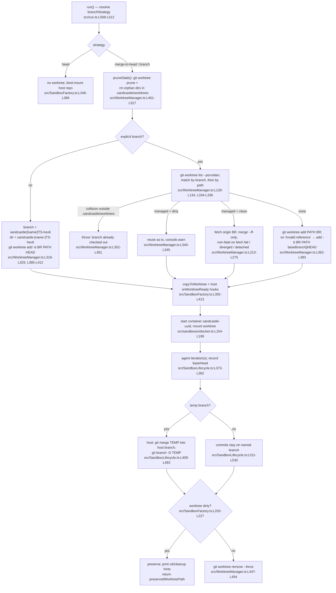

# Sandcastle: worktree management and task reading

Source: https://github.com/mattpocock/sandcastle @ `e99f832f26dc9d245c019a9ddd19fa5dee792427` (shallow clone, read-only).

## Summary

- Sandcastle is a **library** (`run()`, `createSandbox()`, `createWorktree()`), not a task runner. It has no task model of its own. The user's `.sandcastle/main.mts` script plus prompt files decide what the agent works on (`src/templates/simple-loop/main.mts:L7-L50`).
- Worktrees always live under `<repo>/.sandcastle/worktrees/<name>/`, created with `git worktree add` (`src/WorktreeManager.ts:L305`, `src/WorktreeManager.ts:L362-L398`). Each one is paired with a throwaway container named `sandcastle-<uuid>` (`src/sandboxes/docker.ts:L154`).
- There are three **branch strategies** (README.md:L1263):
  - `head` has no worktree and bind-mounts the host checkout. It is the default for bind-mount providers.
  - `merge-to-head` makes a temporary branch `sandcastle/[<name>/]<YYYYMMDD-HHMMSS>-<hex6>` and merges it into the host's current branch. It is the default for isolated providers.
  - `branch` uses a caller-named branch that is reused across runs (`src/run.ts:L508-L512`, `src/WorktreeManager.ts:L313-L329`).
- Reuse is the default for a named branch:
  - A clean worktree is fast-forwarded from `origin/<branch>` with `--ff-only`.
  - A dirty worktree is reused with a warning.
  - If the branch is checked out outside `.sandcastle/worktrees/`, Sandcastle throws (`src/WorktreeManager.ts:L331-L361`, `docs/adr/0003-reuse-worktree-by-default.md`).
- Cleanup happens when the scope closes. A clean worktree is removed (`git worktree remove --force`); a dirty one is kept and its path is printed and returned as `preservedWorktreePath` (`src/SandboxFactory.ts:L203-L227`). Leftovers are cleared at the start of the next run by `pruneStale()` (`src/WorktreeManager.ts:L461-L527`).
- Tasks are read **by the agent, inside the sandbox**: the prompt has a shell expansion `` !`{{LIST_TASKS_COMMAND}}` `` that runs before each iteration. For GitHub that command is `gh issue list --state open --label Sandcastle --limit 100 --json …` (`src/InitService.ts:L535`, `src/Orchestrator.ts:L406-L414`).
- Ordering, filtering, selection, and closing are prompt instructions, not code. The agent picks one issue using a priority list, commits, and runs `gh issue close` itself. The tool only counts commits, merges branches, and stops when it sees `<promise>COMPLETE</promise>` (`src/templates/simple-loop/prompt.md:L17-L53`, `src/Orchestrator.ts:L548`).
- Nothing in `src/` pushes or opens PRs. Results are commits: the tool merges them into the host branch or leaves them on the named branch (`src/SandboxLifecycle.ts:L409-L530`).

## Worktree lifecycle

Details:

1. **Location and naming.**
   - Root: `<repo>/.sandcastle/worktrees/` (`src/WorktreeManager.ts:L305`). The init scaffold gitignores `worktrees/` and `logs/` (`src/InitService.ts:L8-L9`).
   - Named branch: the directory is the branch name with `/` replaced by `-` (`src/WorktreeManager.ts:L315`).
   - Temp branch: the timestamp plus 3 random bytes prevent collisions between concurrent forks (`src/WorktreeManager.ts:L32-L38`, `src/WorktreeManager.ts:L82-L89`). `sanitizeName` lowercases the name and turns anything outside `[a-z0-9]` into `-` (`src/WorktreeManager.ts:L41-L42`).
2. **Branch derivation.** Sandcastle never derives a branch from a task.
   - A named branch comes from the caller via `branchStrategy: { type: "branch", branch, baseBranch? }`.
   - In the `parallel-planner` template, the **planner agent** is told to emit the deterministic name `sandcastle/issue-{id}` so that re-planning resumes the same branch (`src/templates/parallel-planner/plan-prompt.md:L25`). The script passes that name back into `run()` (`src/templates/parallel-planner/main.mts:L115`).
3. **Base branch.** New named branches start from `baseBranch ?? HEAD` (`src/WorktreeManager.ts:L377`). Temp branches always start from host `HEAD` (`src/WorktreeManager.ts:L394`). On first creation, keeping the base current is the caller's job (ADR 0003, "Scope").
4. **Sync with base/origin.** Sync only happens when a clean worktree is reused. It runs `git fetch origin <branch>`, then `git merge --ff-only origin/<branch>`.
   - It is skipped when HEAD is detached (for example, mid-rebase), when the fetch fails, or when the branch has diverged. The worktree is then reused as-is (`src/WorktreeManager.ts:L213-L275`).
   - There is never a rebase or merge of the base branch into the worktree.
   - Git calls add `-c branch.autoSetupMerge=false -c push.autoSetupRemote=false` to avoid racing on `.git/config.lock` (`src/WorktreeManager.ts:L16-L21`). They also force `LC_ALL=C` so stderr matching stays stable (`src/WorktreeManager.ts:L49-L57`).
5. **Isolated providers (cloud VMs).**
   - **In:** `git bundle create --all` → copy in → `git clone` → `git checkout <branch>` (`src/syncIn.ts:L104-L138`).
   - **Out:** `git format-patch` in the sandbox → `git am --3way` on the host (`src/syncOut.ts:L368`). Sandbox-owned `refs/sandcastle/sync-base` tracks the last patch base (ADR 0017).
6. **Conflicts.**
   - **Temp-branch merge to host fails:** the run fails, the temp branch is kept, and Sandcastle prints `git merge <temp>` / `git branch -D <temp>` retry hints (`src/SandboxLifecycle.ts:L441-L456`).
   - **Sync-out `am` fails:** artifacts are saved first to `.sandcastle/patches/<ts>/` and recovery commands are printed (`src/syncOut.ts:L5-L9`, `src/syncOut.ts:L145`).
   - **Parallel branches:** conflicts between branches are delegated to a **merge agent** prompt (`src/templates/parallel-planner/merge-prompt.md:L1-L26`).
7. **Leftovers from a previous run.**
   - `pruneStale()` runs `git worktree prune`, then deletes any directory under `.sandcastle/worktrees/` that git no longer lists. It resolves paths with realpath first (`src/WorktreeManager.ts:L472-L526`). It is best-effort: failure only logs a warning (`src/SandboxFactory.ts:L318-L326`).
   - Preserved (dirty) worktrees are still registered with git, so they survive pruning. They are reused if the same named branch is requested again.
   - Containers are removed with `docker rm -f` through a shared shutdown registry on exit/SIGINT/SIGTERM (`src/sandboxes/docker.ts:L236-L245`).
8. **Locking.** ADR 0007 specifies PID lock files at `.sandcastle/locks/<name>.lock`, but no code in `src/` references `locks`. Concurrent runs on the same named branch are not prevented at this commit.
9. **Granularity.** `factory.withSandbox` is called **inside** the iteration loop (`src/Orchestrator.ts:L355-L359`), so every iteration acquires and releases its own worktree and container. Effects by strategy:
   - `merge-to-head`: each iteration gets a fresh temp branch that is merged back after the iteration.
   - `branch`: each iteration reuses the same worktree (collision → reuse).
   - Callers who want one long-lived worktree use `createWorktree()` / `createSandbox()` instead (README.md:L261, README.md:L419).

## Task reading

- **Source.** The issue tracker is chosen at `sandcastle init` and baked into the prompt files as template args (`src/InitService.ts:L486-L567`):
  - `github-issues`: `gh issue list --state open --label Sandcastle --limit 100 --json number,title,body,labels,comments --jq …` (`src/InitService.ts:L535`). View uses `gh issue view <ID>`; close uses `gh issue close <ID> --comment "Completed by Sandcastle"` (`src/InitService.ts:L536-L537`).
  - `beads`: `bd ready --json` / `bd close` (`src/InitService.ts:L549-L551`).
  - `custom`: a sentinel that fails until the user configures it (`src/InitService.ts:L524-L527`, `src/InitService.ts:L563`).
  - If the user declines the label, ` --label Sandcastle` is stripped from the prompt files, so all open issues are listed (`src/InitService.ts:L818-L838`).
  - There is no parent/sub-issue traversal. The prompt only says "If it has a parent PRD, pull that in too" (`src/templates/parallel-planner/implement-prompt.md:L5`).
- **When it's read.**
  - Before every iteration, `preprocessPrompt` runs each `` !`cmd` `` **inside the sandbox** and inlines its stdout (`src/Orchestrator.ts:L406-L414`, `src/PromptPreprocessor.ts:L23`). A non-zero exit fails the run (`src/PromptPreprocessor.ts:L67`, ADR 0020).
  - So the list is always fresh, and the sandbox needs `gh` plus `GH_TOKEN` (`src/InitService.ts:L539-L542`).
- **Ordering, filtering, selection.** All of these are natural-language prompt instructions:
  - `simple-loop`: priority order is bug → tracer bullet → polish → refactor. Pick the highest-priority issue that is not blocked, one per iteration (`src/templates/simple-loop/prompt.md:L17-L26`, `src/templates/simple-loop/prompt.md:L44`).
  - `parallel-planner`: a planner agent builds a dependency graph and returns `<plan>{"issues":[{id,title,branch}]}</plan>`. The script validates it with Zod via `Output.object` (`src/templates/parallel-planner/plan-prompt.md:L1-L37`, `src/templates/parallel-planner/main.mts:L25-L31`, `src/templates/parallel-planner/main.mts:L66-L81`). This is the only place code sees task IDs.
- **In-progress / done marking.**
  - There is no in-progress marker: no label, assignee, or comment is written when work starts.
  - **Done:** the agent runs `CLOSE_TASK_COMMAND`.
    - `simple-loop`: the implementer closes the issue after committing (`src/templates/simple-loop/prompt.md:L40`, `src/templates/simple-loop/prompt.md:L45`).
    - `parallel-planner`: implementers must not close issues (`src/templates/parallel-planner/implement-prompt.md:L56`). The merge agent closes each issue whose branch it merged (`src/templates/parallel-planner/merge-prompt.md:L16-L22`).
  - **Blocked:** the agent comments on the issue and moves on (`src/templates/simple-loop/prompt.md:L47`).
- **Loop termination.** An iteration loop ends when the output contains `<promise>COMPLETE</promise>` (default signal) or `maxIterations` is reached (`src/Orchestrator.ts:L246`, `src/Orchestrator.ts:L548-L590`). In the planner template, the outer loop ends when the plan is empty (`src/templates/parallel-planner/main.mts:L85-L89`).

## Who does what (tool vs agent)

| Concern | Tool code (Sandcastle library / user script) | Agent (via prompt) |
|---|---|---|
| Create / reuse / remove worktree | `WorktreeManager.create/remove/pruneStale` (`src/WorktreeManager.ts:L291`, `src/WorktreeManager.ts:L447`, `src/WorktreeManager.ts:L461`) | — |
| Container lifecycle | `docker.ts` provider (`src/sandboxes/docker.ts:L154-L245`) | — |
| Branch name | Temp: `generateTempBranchName` (`src/WorktreeManager.ts:L82`). Named: caller argument | Planner agent emits `sandcastle/issue-{id}` (`src/templates/parallel-planner/plan-prompt.md:L25`) |
| Refresh from origin | ff-only on clean reuse (`src/WorktreeManager.ts:L213-L275`) | — |
| List tasks | Runs the prompt's `` !`gh issue list …` `` in the sandbox (`src/Orchestrator.ts:L410`) | Interprets the list |
| Order / select / dependency analysis | Script fans out over the planner's JSON (`src/templates/parallel-planner/main.mts:L107-L130`) | Priority rules, blocked check, dependency graph |
| Mark in progress | None | None |
| Commit | Collects commits via `git rev-list baseHead..` (`src/SandboxLifecycle.ts:L486-L530`) | Writes code, runs tests, `git commit` with a `RALPH:` prefix (`src/templates/simple-loop/prompt.md:L33-L39`) |
| Merge to target | Temp branch → host branch `git merge` (`src/SandboxLifecycle.ts:L443`) | Parallel branches: merge agent runs `git merge` and resolves conflicts (`src/templates/parallel-planner/merge-prompt.md:L7-L12`) |
| Close task | — | `gh issue close <ID>` |
| Push / PR | Not implemented anywhere in `src/` | Not in shipped templates |
| Stop condition | Completion signal match / `maxIterations` (`src/Orchestrator.ts:L548`) | Emits `<promise>COMPLETE</promise>` |

## Implications for ralph dev

- **Copy the worktree conventions, not the task model.** Use a repo-local `.<tool>/worktrees/<branch-with-dashes>` root. Use deterministic branch names per task (Sandcastle's `sandcastle/issue-{id}` idea), generated by Python from the sub-issue number rather than by an agent. Reuse a managed worktree, and fail if the branch is checked out elsewhere.
- **Use the safe refresh rule on reuse.** Fast-forward with `fetch` + `merge --ff-only` only when the worktree is clean and HEAD is attached. Otherwise log and reuse as-is. Never `reset --hard`. Also run `git worktree prune` plus an orphan-directory sweep at start, and pass `-c branch.autoSetupMerge=false` and `LC_ALL=C` to git.
- **Implement the lock that Sandcastle only designed.** Sandcastle's ADR 0007 PID lock is not in the code. If ralph dev can run concurrently, add an `O_EXCL` lock file outside the worktree, with stale-PID recovery.
- **Move task reading into Python.** Sandcastle hands it to the agent via `gh issue list` with a label filter and has no sub-issue support. ralph dev should fetch the spec issue's sub-issues itself (GraphQL `subIssues`), filter and order them deterministically, and pass the single selected issue into the prompt. This avoids the "agent picks the wrong issue" and "agent needs `GH_TOKEN`" problems.
- **Own state transitions in the tool.** Sandcastle has no in-progress marker, and closing is the agent's job. ralph dev should mark in-progress and done (label, comment, or close) from Python, based on observed commits and the completion signal, not on the agent's own claim.
- **Decide push/PR ownership explicitly.** Sandcastle never pushes or opens PRs. Its useful pattern is: record `baseHead`, count `rev-list baseHead..branch` after the agent finishes, and treat zero commits as "nothing to merge". Keep the worktree when it is dirty and surface its path for recovery.
